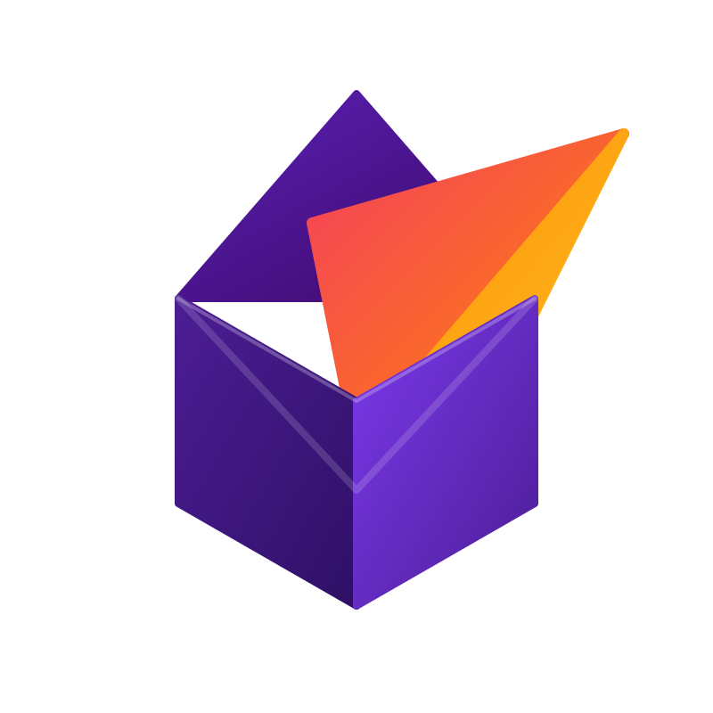
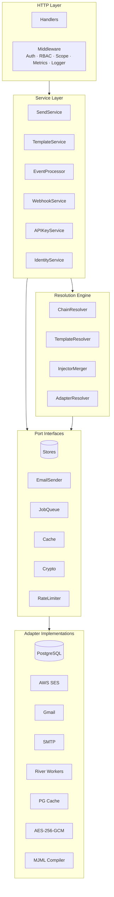
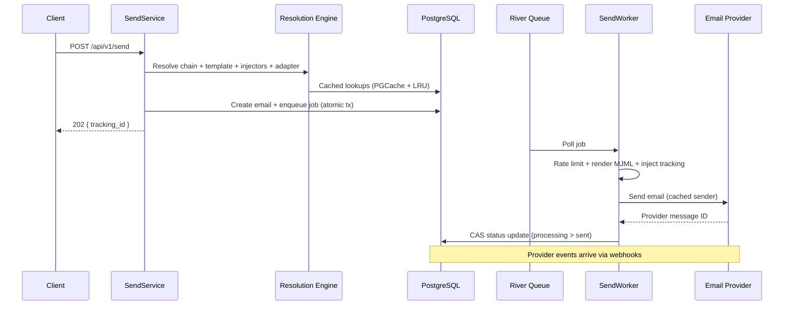
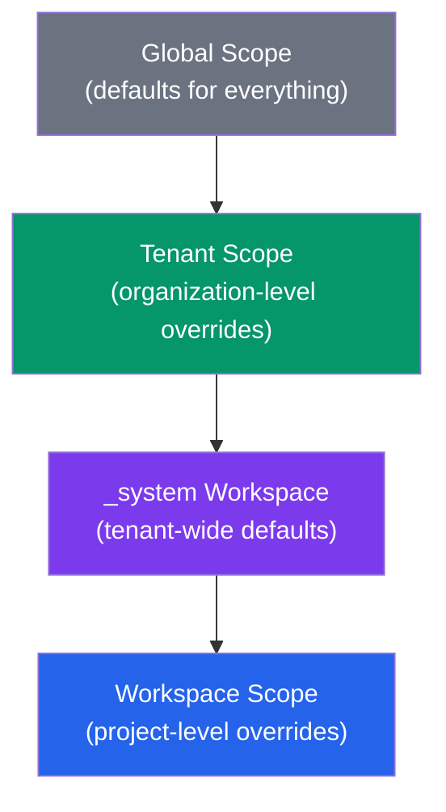
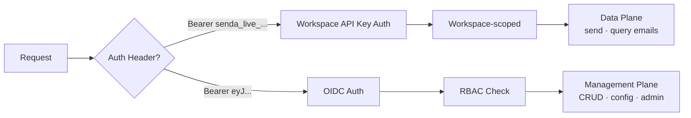

<div align="center">
  
  <h1>Senda</h1>
  <p><strong>Open-source email orchestration for multi-tenant SaaS</strong></p>
  <p>Templates, inheritance, provider-agnostic delivery — one API call.</p>

[](https://go.dev)
[](https://www.postgresql.org)
[](https://nextjs.org)
[](LICENSE)
[](https://github.com/TetherEducation/senda/actions)

[Documentation](docs/) &middot; [API Reference](docs/API.md) &middot; [Quick Start](#quick-start) &middot; [Contributing](#contributing)

</div>

---

## Why Senda?

Most email services are either too simple (no multi-tenancy) or too complex (Kafka, Redis, microservices). Senda sits in the sweet spot:

- **Zero external dependencies** — PostgreSQL handles queue ([River](https://riverqueue.com)), cache (UNLOGGED tables), and rate limiting (PL/pgSQL token bucket). No Redis. No Kafka.
- **3-level hierarchy** — Configure templates, injectors, and adapters at Global scope. Override at Tenant or Workspace level. Inheritance chain resolves automatically.
- **MJML-native** — Write responsive email templates in MJML. Compiled to battle-tested HTML at send time with variable injection and locale fallback.
- **Dual auth model** — OIDC/JWT for humans on the management plane. Workspace-scoped API keys for machines on the data plane. 5-tier RBAC.
- **Full-stack** — Go backend + Next.js 16 dashboard with dark mode, scope switcher, template editor (Monaco), and real-time metrics.

---

## Features

|               | Feature             | Description                                                                                                    |
| ------------- | ------------------- | -------------------------------------------------------------------------------------------------------------- |
| **Hierarchy** | Multi-tenant scopes | Global > Tenant > Workspace with inheritance chain resolution                                                  |
| **Templates** | Versioned + i18n    | Draft > Published > Archived lifecycle. Locale fallback (exact > prefix > workspace default > version default) |
| **Providers** | Adapter system      | SES, Gmail, SMTP built-in. Add any provider by implementing one interface                                      |
| **Rendering** | MJML compiler       | Responsive HTML from MJML templates. Variable injection via injector merge                                     |
| **Webhooks**  | Event delivery      | HMAC-SHA256 signed. Exponential backoff. Auto-disable after 10 consecutive failures                            |
| **Tracking**  | Open & click        | Pixel injection for opens. Provider event ingestion (delivered, bounced, complained)                           |
| **Security**  | Defense in depth    | AES-256-GCM at rest, HMAC API keys, SSRF protection, CSP/HSTS headers, advisory-locked onboarding              |
| **Audit**     | Full trail          | Every mutation logged with actor, scope, entity, and change diff                                               |
| **MCP**       | AI-ready            | OpenAPI-backed MCP server for Claude Code, Codex, and Gemini CLI                                               |
| **Dashboard** | Full-stack UI       | Next.js 16 + shadcn/ui. Templates, adapters, members, metrics, settings                                        |

---

## Quick Start

**Prerequisites:** Docker, Go 1.25+, Node 22+, Make

```bash
# 1. Clone and start
git clone https://github.com/senda-app/senda.git && cd senda
make dev

# 2. Verify (wait ~30s for Keycloak)
curl http://localhost:8081/health
# {"status":"ok"}

# 3. Send your first email
curl -X POST http://localhost:8081/api/v1/send \
  -H "Authorization: Bearer senda_live_YOUR_KEY" \
  -H "Content-Type: application/json" \
  -d '{
    "ref": "acme:main:welcome-email",
    "to": ["user@example.com"],
    "variables": { "name": "Jane" },
    "locale": "es"
  }'
```

Check the email in [Mailpit UI](http://localhost:8026). Start the frontend with `npm --prefix web install && npm --prefix web run dev`.

---

## Use as a Library

Senda can be imported as a Go module. Register custom **code injectors** to feed business-specific data into templates, add an **init function** for shared per-request context, and wire **lifecycle hooks** for your infrastructure.

```bash
go get github.com/senda-app/senda
```

```go
package main

import (
    "context"
    "github.com/senda-app/senda/sdk"
)

func main() {
    engine := sdk.NewWithConfig("config.yaml")

    // Per-request init: load shared data before injectors run.
    engine.SetInitFunc(func(ctx context.Context, injCtx *sdk.InjectorContext) (any, error) {
        return loadStudent(ctx, injCtx.Header("X-Case-Id"))
    })

    // Custom injector: values merge with DB injectors into templates.
    // Templates use {{ injector.student.full_name }}.
    engine.RegisterInjector(&StudentInjector{})

    // Lifecycle hooks for your infrastructure.
    engine.OnStart(func(ctx context.Context) error  { return connectMongo(ctx) })
    engine.OnShutdown(func(ctx context.Context) error { return closeMongo(ctx) })

    engine.Run()
}
```

<details>
<summary><strong>Implementing an Injector</strong></summary>

```go
type StudentInjector struct{}

func (i *StudentInjector) Code() string { return "student" }

func (i *StudentInjector) Resolve() (sdk.ResolveFunc, []string) {
    return func(ctx context.Context, injCtx *sdk.InjectorContext) (map[string]any, error) {
        student := injCtx.InitData().(*Student)
        return map[string]any{
            "full_name": student.FullName,
            "email":     student.Email,
            "grade":     student.Grade,
        }, nil
    }, nil // no dependencies on other injectors
}

func (i *StudentInjector) IsCritical() bool        { return true }
func (i *StudentInjector) Timeout() time.Duration   { return 10 * time.Second }
```

**Key concepts:**
- `Code()` maps to the template namespace: `{{ injector.<Code()>.<field> }}`
- `Resolve()` returns `(resolveFunc, dependencies)` — dependencies are other injector codes that must resolve first
- `IsCritical()` — if `true`, a failure aborts the send; if `false`, the injector is silently skipped
- Code injector values merge with DB injectors. On name collision, code injectors win (with a warning log)
- `InjectorContext` provides: HTTP headers, send request variables, init data, tenant/workspace IDs, and other resolved injectors

</details>

**What's extensible (SDK):** Code injectors, init function, lifecycle hooks (OnStart/OnShutdown).

**What's internal (config):** Email senders (SES/Gmail/SMTP), cache, crypto, queue, rate limiter, auth, middleware, resolution engine. All managed via YAML config.

Update Senda independently — `go get -u github.com/senda-app/senda@latest` — your extensions keep working.

---

## Architecture

Hexagonal (Ports & Adapters). Domain logic has zero infrastructure dependencies.



---

## How Sending Works



---

## Tech Stack

<table>
<tr><td>

**Backend**

| Component  | Technology              |
| ---------- | ----------------------- |
| Language   | Go 1.25+                |
| Database   | PostgreSQL 16 + pg_cron |
| HTTP       | Echo v5                 |
| Job Queue  | River (PG-native)       |
| Templates  | gomjml (MJML)           |
| Encryption | AES-256-GCM (HKDF)      |
| Cache      | PG UNLOGGED tables      |
| Rate Limit | PL/pgSQL token bucket   |

</td><td>

**Frontend**

| Component | Technology                      |
| --------- | ------------------------------- |
| Framework | Next.js 16                      |
| UI        | React 19 + shadcn/ui            |
| Styling   | Tailwind CSS v4                 |
| State     | TanStack Query 5                |
| Forms     | React Hook Form + Zod 4         |
| Auth      | Auth.js v5 (OIDC)               |
| Theme     | next-themes (light/dark/system) |
| Editor    | Monaco Editor                   |

</td></tr>
</table>

---

## API at a Glance

| Group      | Endpoint                                    | Auth         | Description                     |
| ---------- | ------------------------------------------- | ------------ | ------------------------------- |
| Health     | `/health`, `/healthz`, `/metrics`           | None / Token | Liveness, readiness, Prometheus |
| Data Plane | `/api/v1/send`, `/api/v1/emails`            | API Key      | Send emails, query status       |
| Management | `/api/v1/manage/tenants/.../workspaces/...` | OIDC         | CRUD for all resources          |
| Global     | `/api/v1/manage/global/...`                 | OIDC         | Global-scope management         |
| Webhooks   | `/api/v1/webhooks/ses/inbound`              | SNS sig      | Provider event ingestion        |
| Tracking   | `/t/o/:tracking_id`                         | None         | Open-tracking pixel             |

> Full reference: [docs/API.md](docs/API.md) | Postman: [docs/postman/](docs/postman/)

---

<details>
<summary><strong>Hierarchy & Resolution</strong></summary>

Senda uses a 3-level scope hierarchy. Resources at lower scopes override those at higher scopes:



**Resolution order:** Workspace > \_system workspace > Global. First match wins. Injectors merge field-by-field across all scopes.

</details>

<details>
<summary><strong>Authentication & RBAC</strong></summary>



| Role            | Scope     | Permissions                              |
| --------------- | --------- | ---------------------------------------- |
| Superadmin      | Global    | Everything                               |
| TenantAdmin     | Tenant    | Manage workspaces, members within tenant |
| WorkspaceAdmin  | Workspace | Full workspace management                |
| WorkspaceEditor | Workspace | Edit templates, injectors, adapters      |
| WorkspaceViewer | Workspace | Read-only access                         |

</details>

<details>
<summary><strong>Configuration</strong></summary>

YAML config with environment variable overrides (`SENDA_` prefix). Priority: env vars > YAML > defaults.

```bash
cp config/config.example.yaml config/config.yaml
```

| Variable                   | Default   | Description                           |
| -------------------------- | --------- | ------------------------------------- |
| `SENDA_DATABASE_URL`       | --        | PostgreSQL connection URL (required)  |
| `SENDA_MASTER_KEY`         | --        | AES-256-GCM key, 32+ chars (required) |
| `SENDA_OIDC_DISCOVERY_URL` | --        | OIDC .well-known URL (required)       |
| `SENDA_OIDC_CLIENT_ID`     | --        | OIDC client ID (required)             |
| `SENDA_HOST`               | `0.0.0.0` | Bind address                          |
| `SENDA_PORT`               | `8080`    | HTTP port                             |
| `SENDA_LOG_LEVEL`          | `info`    | debug, info, warn, error              |
| `SENDA_TRACKING_BASE_URL`  | --        | Base URL for open-tracking pixels     |

See [`config/config.example.yaml`](config/config.example.yaml) for all options.

</details>

<details>
<summary><strong>MCP Integration (AI Agents)</strong></summary>

Senda ships a single MCP server definition named `senda`, backed by
[`mcp-openapi-proxy`](https://github.com/rendis/mcp-openapi-proxy) and the committed
OpenAPI 3 spec at [`cmd/senda/docs/openapi.yaml`](cmd/senda/docs/openapi.yaml).

**Install:**

```bash
go install github.com/rendis/mcp-openapi-proxy/cmd/mcp-openapi-proxy@latest
```

**Regenerate spec:**

```bash
make swagger
```

The repo includes `.mcp.json` with the server config. It exposes three tools:

- `senda_list_endpoints` — discover operations
- `senda_describe_endpoint` — inspect params and body
- `senda_call_endpoint` — execute an endpoint

**Authentication:**

- Data plane: `export MCP_AUTH_WORKSPACEAPIKEYBEARER_TOKEN="senda_live_..."`
- Management plane: `mcp-openapi-proxy login --mcp-config ./.mcp.json --server senda`

**Supported clients:** Claude Code (auto-detects `.mcp.json`), Codex, Gemini CLI.

> Full MCP setup guide with examples for each client: see the `.mcp.json` file and `AGENTS.md`.

</details>

<details>
<summary><strong>Docker Services</strong></summary>

**Dev stack** (`make dev`):

| Service  | Port      | Purpose                     |
| -------- | --------- | --------------------------- |
| senda    | 8081      | Backend (Air hot-reload)    |
| postgres | 5435      | PostgreSQL 16 + pg_cron     |
| keycloak | 9090      | OIDC provider (admin/admin) |
| mailpit  | 1026/8026 | SMTP capture + Web UI       |
| caddy    | 443       | HTTPS proxy (optional)      |

**Test users:**

| Email                      | Password         | Role            |
| -------------------------- | ---------------- | --------------- |
| admin@senda.dev            | admin            | Superadmin      |
| tenant-admin@senda.dev     | tenant-admin     | TenantAdmin     |
| workspace-admin@senda.dev  | workspace-admin  | WorkspaceAdmin  |
| workspace-editor@senda.dev | workspace-editor | WorkspaceEditor |
| workspace-viewer@senda.dev | workspace-viewer | WorkspaceViewer |

</details>

---

## Development

| Command                 | Description                        |
| ----------------------- | ---------------------------------- |
| `make dev`              | Start full Docker stack            |
| `make build`            | Build Go binary                    |
| `make test`             | Unit tests (race detector)         |
| `make test-integration` | Integration tests (TestContainers) |
| `make test-e2e`         | E2E deterministic gate             |
| `make lint`             | golangci-lint                      |
| `make swagger`          | Regenerate OpenAPI spec            |
| `make system-pr`        | PR gate (functional + UI)          |

Frontend: `npm --prefix web run dev` | `npm --prefix web run build` | `npm --prefix web run lint`

> Full guide: [docs/DEVELOPMENT.md](docs/DEVELOPMENT.md)

---

## Project Structure

```
senda/
├── sdk/                    Public SDK (Engine, Injector, InjectorContext)
├── cmd/senda/              Entry point (uses sdk.Engine)
├── internal/
│   ├── domain/             Entities, value objects, domain errors
│   ├── port/               Interface contracts (incl. CodeInjector)
│   ├── service/            Business logic
│   ├── resolution/         Hierarchy chain resolution engine
│   ├── adapter/            PostgreSQL, SES, Gmail, SMTP, River, MJML, Crypto
│   ├── http/               Handlers + middleware
│   └── app/                Bootstrap + DI wiring
├── pkg/                    Shared utilities
├── migrations/             28 SQL migrations
├── config/                 YAML configuration
├── docker/                 Dockerfiles + Compose
├── test/                   E2E + system tests
└── web/                    Next.js 16 frontend
```

---

## Documentation

|                      | Document                                                           | Description                                    |
| -------------------- | ------------------------------------------------------------------ | ---------------------------------------------- |
| **Extensibility**    | [docs/extensibility-guide.md](docs/extensibility-guide.md)         | SDK guide: injectors, init, hooks, examples    |
| **Architecture**     | [docs/ARCHITECTURE.md](docs/ARCHITECTURE.md)                       | Hexagonal layers, resolution engine, ADRs      |
| **API**              | [docs/API.md](docs/API.md)                                        | All endpoints, auth schemes, error codes       |
| **Development**      | [docs/DEVELOPMENT.md](docs/DEVELOPMENT.md)                        | Setup, Docker, testing, troubleshooting        |
| **Deployment**       | [docs/DEPLOYMENT.md](docs/DEPLOYMENT.md)                          | Production Dockerfile, env vars, health checks |
| **Postman**          | [docs/postman/](docs/postman/)                                    | Collection + environments                      |
| **Tech Spec**        | [docs/specs/TECH_SPEC_v1.md](docs/specs/TECH_SPEC_v1.md)          | Complete technical specification               |

---

## Contributing

We welcome contributions! Whether it's bug reports, feature requests, or pull requests.

1. Fork the repo
2. Create a feature branch (`git checkout -b feat/amazing-feature`)
3. Write tests first (TDD mandatory)
4. Run quality gates: `make test && make lint`
5. Open a PR

See [AGENTS.md](AGENTS.md) for the full development workflow, story system, and team structure.

---

<div align="center">
  <sub>Built with Go, PostgreSQL, and Next.js. No Redis required.</sub>
  <br/>
  <a href="LICENSE">MIT License</a>
</div>
