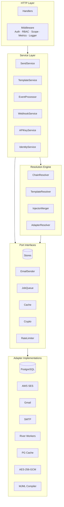
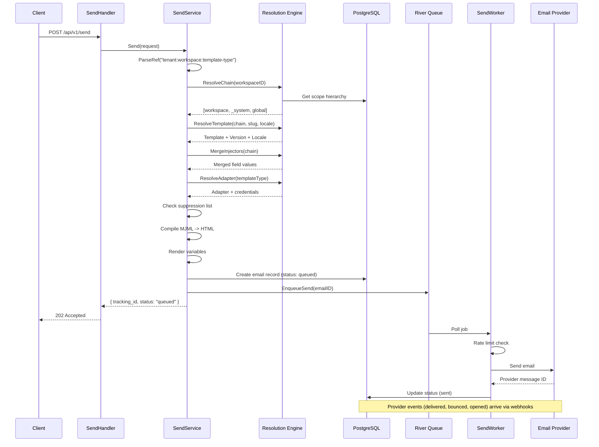
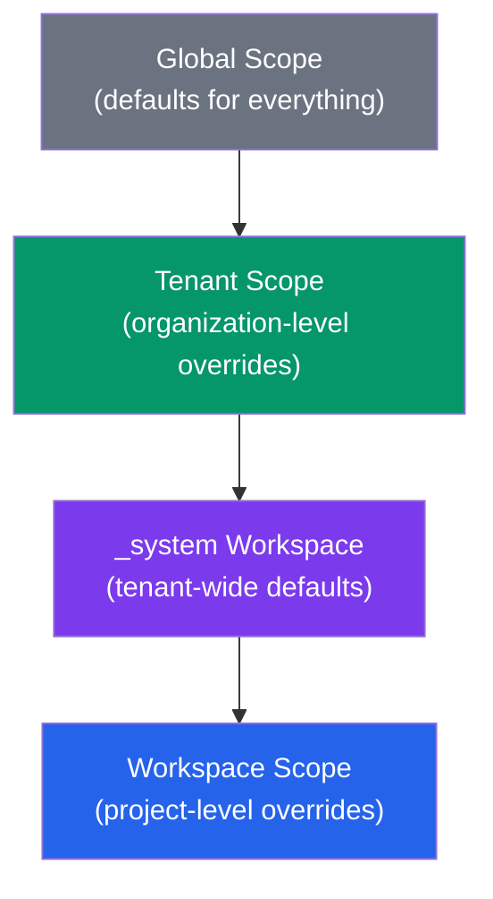
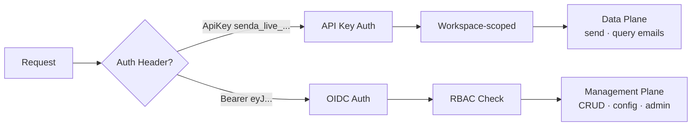

# Senda

Open-source email orchestration platform with multi-tenant hierarchy, template versioning, and provider-agnostic delivery.

[](https://go.dev)
[](https://www.postgresql.org)
[](LICENSE)

## What is Senda?

Senda lets you manage transactional email across organizations with a 3-level hierarchy: **Global > Tenant > Workspace**. Templates, injectors, and adapters inherit down the chain — configure once at the top, override where needed.

- **Multi-tenant hierarchy** — Global, Tenant, and Workspace scopes with inheritance chain resolution
- **Template versioning** — Draft > Published > Archived lifecycle with locale support (i18n)
- **Provider-agnostic** — Adapter system supports SES, Gmail, SMTP; add any provider
- **MJML-native** — Responsive email templates compiled to HTML at send time
- **Dual auth** — OIDC/JWT for humans (management plane), API Keys for machines (data plane)
- **Webhook system** — Real-time event delivery with HMAC-SHA256 signatures
- **Full audit trail** — Every mutation logged with actor, scope, and change diff
- **Provider-managed security** — SPF, DKIM, DMARC handled by email providers ([ADR-0001](docs/specs/ADR-0001-provider-managed-email-auth.md))

## Architecture

Hexagonal (Ports & Adapters). Domain logic has zero infrastructure dependencies.



> Deep-dive: [docs/ARCHITECTURE.md](docs/ARCHITECTURE.md)

## Tech Stack

### Backend

| Component       | Technology                 |
| --------------- | -------------------------- |
| Language        | Go 1.25+                   |
| Database        | PostgreSQL 16 + pg_cron    |
| HTTP Framework  | Echo v5                    |
| Job Queue       | River (PG-native)          |
| DB Driver       | pgx v5                     |
| Migrations      | golang-migrate             |
| Email Templates | gomjml (MJML compiler)     |
| Cache           | PG UNLOGGED tables         |
| Rate Limiting   | PL/pgSQL token bucket      |
| Encryption      | AES-256-GCM (HKDF)        |

No Redis. No external message broker. PostgreSQL handles everything.

### Frontend

| Component       | Technology                 |
| --------------- | -------------------------- |
| Framework       | Next.js 16                 |
| UI              | React 19 + TypeScript 5    |
| Styling         | Tailwind CSS v4 + shadcn/ui|
| State           | TanStack Query 5           |
| Tables          | TanStack Table 8           |
| Forms           | React Hook Form 7 + Zod 4  |
| Auth            | Auth.js v5 (OIDC)          |
| HTTP Client     | ky                         |
| i18n            | next-intl (en, es)         |
| Code Editor     | Monaco Editor              |
| Charts          | Recharts                   |

## Quick Start

### Prerequisites

- Docker & Docker Compose
- Go 1.25+ (for local development)
- Node 22+ (for frontend development)
- Make

### Start the dev stack

```bash
git clone https://github.com/senda-app/senda.git
cd senda

# Start backend + PostgreSQL + Keycloak + Mailpit
make dev

# Wait ~30s for Keycloak to initialize, then verify:
curl http://localhost:8081/health
# {"status":"ok"}
```

Migrations run automatically on start. The stack includes:

| Service      | URL                        | Purpose                |
| ------------ | -------------------------- | ---------------------- |
| Senda API    | http://localhost:8081      | Backend                |
| Keycloak     | http://localhost:9090      | OIDC provider (admin/admin) |
| Mailpit UI   | http://localhost:8026      | Email capture          |
| PostgreSQL   | localhost:5435             | Database (senda/senda) |

### Start the frontend

```bash
npm --prefix web install
npm --prefix web run dev
# → http://localhost:3000
```

### Send your first email

```bash
curl -X POST http://localhost:8081/api/v1/send \
  -H "Authorization: ApiKey senda_live_YOUR_KEY" \
  -H "Content-Type: application/json" \
  -d '{
    "to": "user@example.com",
    "template_type": "acme:main:welcome-email",
    "variables": { "name": "Jane", "activation_url": "https://..." },
    "locale": "es"
  }'
```

Response: `{ "tracking_id": "snd_...", "status": "queued" }`

Check the email in [Mailpit UI](http://localhost:8026).

## Project Structure

```
senda/
├── cmd/senda/              Entry point + DI composition
├── internal/
│   ├── domain/             Entities, value objects, domain errors
│   ├── port/               Interface contracts (stores, senders, crypto, cache, queue)
│   ├── service/            Business logic (Send, Template, Event, Webhook, APIKey, Identity)
│   ├── resolution/         Hierarchy chain resolution engine
│   ├── adapter/
│   │   ├── postgres/       PG store implementations (pgx v5) + rate limiter
│   │   ├── pgcache/        PG UNLOGGED cache
│   │   ├── ses/            AWS SES sender + identity provider
│   │   ├── gmail/          Gmail sender + identity provider
│   │   ├── smtp/           SMTP sender (dev/Mailpit)
│   │   ├── river/          Background workers (send + webhook)
│   │   ├── mjml/           MJML -> HTML compiler
│   │   └── crypto/         AES-256-GCM encryption
│   ├── http/
│   │   ├── handler/        HTTP handlers (26+)
│   │   └── middleware/     Auth, RBAC, scope, logger, metrics, recovery
│   └── app/                Bootstrap + DI wiring
├── pkg/                    Shared utilities (apperr, slug, tracking)
├── migrations/             24 SQL migrations
├── config/                 YAML configuration
├── docker/                 Dockerfiles + Compose files + Keycloak realm
├── test/
│   ├── e2e/               End-to-end tests
│   └── system/            System tests (API contract, UI flow, visual, a11y)
└── web/                    Next.js 16 frontend
    └── src/
        ├── app/            App Router (auth, dashboard, global/tenant/workspace scopes)
        ├── components/     UI (shadcn) + shared (DataTable, FormDialog, PageShell, etc.)
        ├── hooks/          22 custom hooks (API, scope, CRUD, pagination, auto-save)
        ├── lib/            API client (ky), locale config, utils
        └── types/          TypeScript type definitions
```

## How Sending Works



## Hierarchy & Resolution

Senda uses a 3-level scope hierarchy. Resources at lower scopes override those at higher scopes:



**Resolution order:** Workspace > _system workspace > Global. The first match wins. Injectors merge field-by-field across all scopes.

## Authentication



### RBAC Roles

| Role             | Scope     | Permissions                              |
| ---------------- | --------- | ---------------------------------------- |
| Superadmin       | Global    | Everything                               |
| TenantAdmin      | Tenant    | Manage workspaces, members within tenant |
| WorkspaceAdmin   | Workspace | Full workspace management                |
| WorkspaceEditor  | Workspace | Edit templates, injectors, adapters      |
| WorkspaceViewer  | Workspace | Read-only access                         |

## Configuration

YAML config with environment variable overrides (`SENDA_` prefix). Priority: env vars > YAML > defaults.

```bash
cp config/config.example.yaml config/config.yaml
```

| Variable                  | Default     | Description                       |
| ------------------------- | ----------- | --------------------------------- |
| `SENDA_HOST`              | `0.0.0.0`  | Bind address                      |
| `SENDA_PORT`              | `8080`      | HTTP port                         |
| `SENDA_DATABASE_URL`      | —           | PostgreSQL connection URL (required) |
| `SENDA_OIDC_DISCOVERY_URL`| —           | OIDC .well-known URL (required)   |
| `SENDA_OIDC_CLIENT_ID`    | —           | OIDC client ID (required)         |
| `SENDA_OIDC_CLIENT_SECRET`| —           | OIDC client secret (required)     |
| `SENDA_MASTER_KEY`        | —           | AES-256-GCM key, 32+ chars (required) |
| `SENDA_SMTP_HOST`         | —           | SMTP server for dev/relay         |
| `SENDA_SMTP_PORT`         | `1025`      | SMTP port                         |
| `SENDA_LOG_LEVEL`         | `info`      | debug, info, warn, error          |
| `SENDA_LOG_FORMAT`        | `json`      | json or text                      |
| `SENDA_TRACKING_BASE_URL` | —           | Base URL for open-tracking pixels |
| `SENDA_MIGRATIONS_PATH`   | `migrations`| Path to SQL migration files       |

See [`config/config.example.yaml`](config/config.example.yaml) for all options.

## API at a Glance

| Group           | Base Path                                      | Auth    | Description                           |
| --------------- | ---------------------------------------------- | ------- | ------------------------------------- |
| Health          | `/health`, `/healthz`, `/metrics`              | None    | Liveness, readiness, Prometheus       |
| Data Plane      | `/api/v1/send`, `/api/v1/emails`               | API Key | Send emails, query status             |
| Onboarding      | `/api/v1/onboarding`                           | Mixed   | Initial platform setup                |
| Management      | `/api/v1/manage/tenants/.../workspaces/...`    | OIDC    | CRUD for all resources                |
| Global          | `/api/v1/manage/global/...`                    | OIDC    | Global-scope resource management      |
| Webhooks (SES)  | `/api/v1/webhooks/ses/inbound`                 | SNS sig | Provider event ingestion              |
| Tracking        | `/t/o/:tracking_id`                            | None    | Open-tracking pixel                   |

> Full API reference: [docs/API.md](docs/API.md) | Postman collection: [docs/postman/](docs/postman/)

## Development

### Makefile Targets

| Category    | Command                | Description                                  |
| ----------- | ---------------------- | -------------------------------------------- |
| Dev         | `make dev`             | Start full Docker stack                      |
|             | `make dev-down`        | Stop stack                                   |
|             | `make dev-clean`       | Stop stack + remove volumes                  |
| Build       | `make build`           | Build Go binary to `bin/senda`               |
| Test        | `make test`            | Unit tests with race detector                |
|             | `make test-integration`| Integration tests (TestContainers)           |
|             | `make test-e2e`        | E2E deterministic gate                       |
|             | `make test-e2e-chaos`  | E2E chaos suite (non-blocking)               |
| System      | `make system-pr`       | PR system gate (functional + UI flow; visual opt-in) |
|             | `make system-nightly`  | Full nightly gate (+ security + a11y; visual opt-in) |
| Database    | `make migrate-up`      | Apply all pending migrations                 |
|             | `make migrate-down`    | Rollback last migration                      |
| Quality     | `make lint`            | golangci-lint                                |
| Cleanup     | `make clean`           | Remove build artifacts                       |

### Frontend Scripts

```bash
npm --prefix web run dev      # Development server (localhost:3000)
npm --prefix web run build    # Production build
npm --prefix web run start    # Production server
npm --prefix web run lint     # ESLint
```

### Testing

| Tier        | Command                | Build Tag      | Infrastructure                  |
| ----------- | ---------------------- | -------------- | ------------------------------- |
| Unit        | `make test`            | —              | None                            |
| Integration | `make test-integration`| `integration`  | TestContainers (PG auto-spun)   |
| E2E         | `make test-e2e`        | `e2e`          | Testcontainers (self-managed)   |
| System      | `make system-pr`       | —              | Testcontainers stack + Browser  |

TDD mandatory. Manual mocks (no frameworks). TestContainers for integration tests.

> Full guide: [docs/DEVELOPMENT.md](docs/DEVELOPMENT.md)

## Docker Services

### Dev Stack (`docker/docker-compose.yml`)

| Service   | Port  | Purpose              |
| --------- | ----- | -------------------- |
| senda     | 8081  | Backend (Air hot-reload) |
| postgres  | 5435  | PostgreSQL 16 + pg_cron  |
| keycloak  | 9090  | OIDC provider            |
| mailpit   | 1026/8026 | SMTP capture + Web UI |
| caddy     | 443   | HTTPS proxy (optional, `--profile https`) |

### E2E Stack (`docker/docker-compose.e2e.yml`)

| Service   | Port  | Difference from dev      |
| --------- | ----- | ------------------------ |
| senda     | 8090  | Compiled binary, dual OIDC mode |
| postgres  | 5436  | Separate volume          |
| mailpit   | 2025/9025 | Separate ports       |

## Dev Credentials

### Keycloak Test Users

| Email                      | Password         | Role             |
| -------------------------- | ---------------- | ---------------- |
| admin@senda.dev            | admin            | Superadmin       |
| tenant-admin@senda.dev     | tenant-admin     | TenantAdmin      |
| workspace-admin@senda.dev  | workspace-admin  | WorkspaceAdmin   |
| workspace-editor@senda.dev | workspace-editor | WorkspaceEditor  |
| workspace-viewer@senda.dev | workspace-viewer | WorkspaceViewer  |

Keycloak admin panel: http://localhost:9090 (admin/admin)

## Documentation

| Document                                          | Description                          |
| ------------------------------------------------- | ------------------------------------ |
| [docs/ARCHITECTURE.md](docs/ARCHITECTURE.md)      | Architecture deep-dive + diagrams    |
| [docs/API.md](docs/API.md)                        | Full API reference                   |
| [docs/DEVELOPMENT.md](docs/DEVELOPMENT.md)        | Developer setup guide                |
| [docs/DEPLOYMENT.md](docs/DEPLOYMENT.md)          | Production deployment guide          |
| [docs/postman/](docs/postman/)                    | Postman collection + environments    |
| [docs/specs/TECH_SPEC_v1.md](docs/specs/TECH_SPEC_v1.md) | Technical specification       |
| [docs/specs/PRD_v5.md](docs/specs/PRD_v5.md)     | Product requirements                 |

## License

[MIT](LICENSE)
