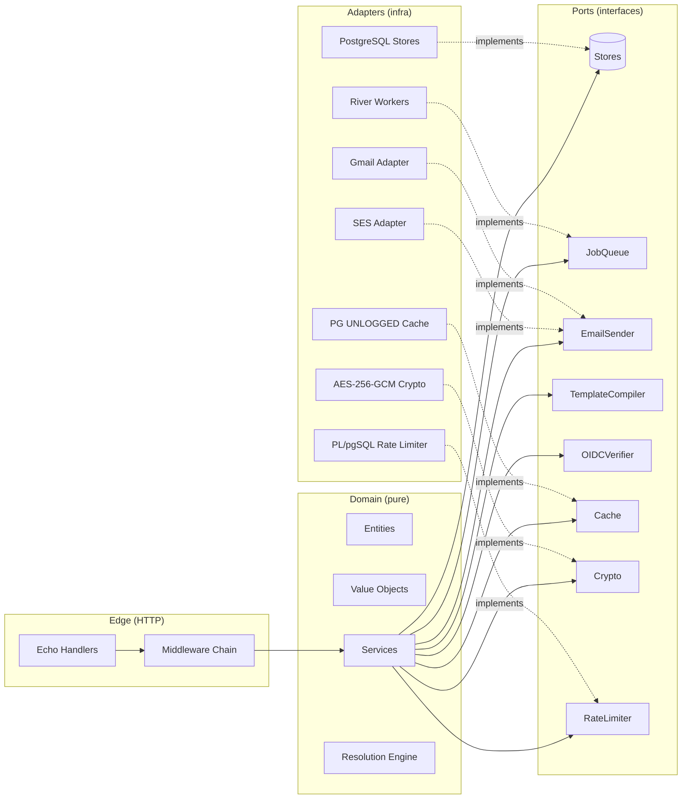
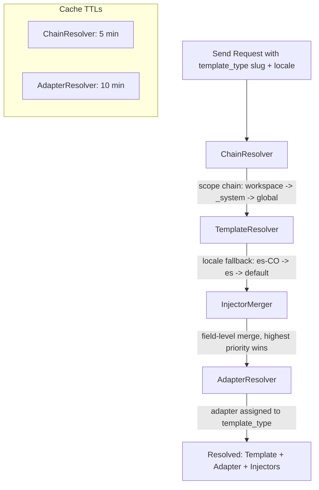
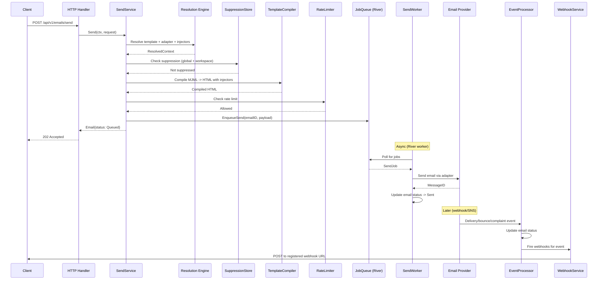
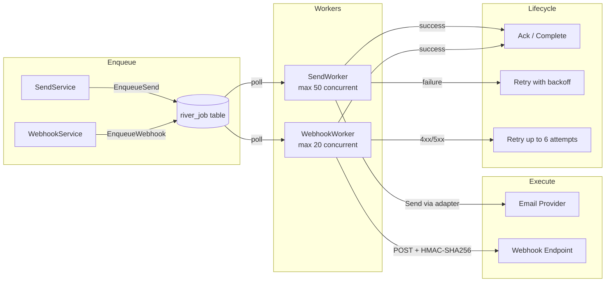

# Senda Architecture

> Email orchestration platform. Go + PostgreSQL. No Redis. Hexagonal architecture.

---

## 1. System Overview

Senda is a multi-tenant email orchestration platform built on a **3-level hierarchy**:

```
Global -> Tenant -> Workspace
```

Each level inherits configuration from its parent through a resolution chain. Templates, injectors, and adapters resolve upward until a match is found.

**Stack:** Go 1.25+, PostgreSQL 16 + pg_cron, Echo v5, River (queue), pgx v5, gomjml, golang-migrate.

---

## 2. Hexagonal Architecture

The codebase follows Ports & Adapters. The domain layer has **zero infrastructure dependencies**.



**Layer rules:**

- `internal/domain/` -- entities and value objects. No imports from other internal packages.
- `internal/port/` -- interfaces. Depends only on domain.
- `internal/service/` -- orchestration. Depends on domain + ports.
- `internal/resolution/` -- resolution engine. Depends on domain + ports.
- `internal/adapter/` -- infrastructure implementations. Implements ports.
- `internal/http/` -- HTTP handlers and middleware. Depends on services.

---

## 3. Domain Entities

### Hierarchy & Access

| Entity         | Description                                                                                 |
| -------------- | ------------------------------------------------------------------------------------------- |
| **Tenant**     | Top-level organization                                                                      |
| **Workspace**  | Isolated environment within a tenant (+ a `_system` workspace per tenant for defaults)      |
| **Member**     | Human user linked via OIDC                                                                  |
| **MemberRole** | 5 roles:`Superadmin`, `TenantAdmin`, `WorkspaceAdmin`, `WorkspaceEditor`, `WorkspaceViewer` |
| **APIKey**     | Machine credential. Prefix `senda_live_`, stored as SHA-256 hash                            |

### Email Infrastructure

| Entity                    | Description                                                   |
| ------------------------- | ------------------------------------------------------------- |
| **Adapter**               | Provider connection (SES, Gmail)                              |
| **AdapterIdentity**       | Email/domain identity. States:`verified`, `pending`, `failed` |
| **TemplateType**          | Slug-addressable category with an assigned adapter            |
| **Template**              | Belongs to a template type                                    |
| **TemplateVersion**       | Lifecycle:`Draft` -> `Published` -> `Archived`                |
| **TemplateVersionLocale** | Localized content for a version                               |

### Operations

| Entity                                       | Description                                                                                                                                |
| -------------------------------------------- | ------------------------------------------------------------------------------------------------------------------------------------------ |
| **InjectorDefinition**                       | Scoped variable definition (workspace,\_system, or global)                                                                                 |
| **InjectorField**                            | Individual field within a definition                                                                                                       |
| **InjectorValue**                            | Field-level value; merged across scopes (highest priority wins)                                                                            |
| **Email**                                    | Send record. States:`Queued` -> `Processing` -> `Sent` -> `Delivered` -> `Opened` -> `Bounced` -> `Complained` -> `Failed` -> `Suppressed` |
| **EmailEvent**                               | State transition log                                                                                                                       |
| **Webhook**                                  | Outbound webhook. HMAC-SHA256 signed, supports wildcard events                                                                             |
| **SuppressionGlobal / SuppressionWorkspace** | Suppression entries. Reasons:`HardBounce`, `Complaint`, `Manual`                                                                           |
| **AuditLog**                                 | Immutable record. Actions:`Create`, `Update`, `Delete`, `Publish`, `Archive`, `Disable`, `Enable`, `Revoke`, `Invite`, `RemoveRole`        |
| **GlobalConfig**                             | System-wide configuration                                                                                                                  |
| **ProviderEvent**                            | Raw inbound event from email providers                                                                                                     |

---

## 4. Port Interfaces

All in `internal/port/`. Services depend only on these interfaces.

**Storage ports:**
`TenantStore`, `WorkspaceStore`, `InjectorStore`, `TemplateStore`, `EmailStore`, `MemberStore`, `SuppressionStore`, `AdapterStore`, `AdapterIdentityStore`, `WebhookStore`, `APIKeyStore`, `AuditLogStore`, `GlobalConfigStore`, `DashboardStore`

**Infrastructure ports:**
`JobQueue` (EnqueueSend, EnqueueWebhook), `EmailSender` (Send, Name, HealthCheck), `TemplateCompiler`, `VariableRenderer`, `OIDCVerifier`, `Cache`, `Crypto`, `RateLimiter`, `IdentityProvider`

---

## 5. Services

| Service               | Responsibility                                                                                                               |
| --------------------- | ---------------------------------------------------------------------------------------------------------------------------- |
| **SendService**       | Full send pipeline: validate -> resolve template -> resolve adapter -> check suppression -> compile -> rate limit -> enqueue |
| **TemplateService**   | Template/version/locale CRUD with lifecycle transitions                                                                      |
| **EventProcessor**    | Processes provider callbacks (bounces, complaints, deliveries, opens) and updates email state                                |
| **WebhookService**    | Fire-and-forget webhook dispatch to registered endpoints                                                                     |
| **APIKeyService**     | Generate, validate, revoke API keys                                                                                          |
| **IdentityService**   | Sync provider identities, manage default sender addresses                                                                    |
| **OnboardingService** | Guided tenant/workspace/adapter setup flow                                                                                   |

---

## 6. Resolution Engine

Located in `internal/resolution/`. Resolves configuration by walking the scope chain upward.



### ChainResolver

Builds the scope chain for a given workspace: `[workspace] -> [_system workspace] -> [global]`. Cached for 5 minutes.

### TemplateResolver

Walks the chain to find a published template matching the requested type slug. Applies locale fallback: specific locale (e.g., `es-CO`) -> language (e.g., `es`) -> default locale.

### InjectorMerger

Collects injector definitions from all scopes in the chain. Merges at field level -- values from the most specific scope (workspace) override less specific ones (global).

### AdapterResolver

Resolves which adapter handles the send. Adapters are assigned per **template type**, not per workspace or template. Cached for 10 minutes.

---

## 7. Send Pipeline

Full sequence from API call to delivery confirmation:



---

## 8. Background Workers

River-based, running inside the Go process with PostgreSQL as the backing store. No external broker.



**SendWorker:** 50 max concurrent workers. Picks up enqueued email jobs, resolves the adapter, calls `EmailSender.Send()`, and updates email status.

**WebhookWorker:** 20 max concurrent workers. Delivers webhook payloads to registered URLs with HMAC-SHA256 signatures. Retries up to 6 times on failure.

---

## 9. Authentication

Dual-auth model:

| Channel         | Mechanism       | Usage                            |
| --------------- | --------------- | -------------------------------- |
| Human users     | OIDC (Keycloak) | Dashboard, admin operations      |
| Machine clients | API Keys        | Programmatic sends, integrations |

**API Keys** use the `senda_live_` prefix. The raw key is shown once at creation; only the SHA-256 hash is stored. Validation compares hashes.

**RBAC** is enforced at the middleware layer based on `MemberRole`. Each endpoint declares its minimum required role.

---

## 10. Infrastructure Decisions

### PostgreSQL-Only Stack (No Redis)

| Concern           | Solution                                                                                                                     |
| ----------------- | ---------------------------------------------------------------------------------------------------------------------------- |
| **Cache**         | PG UNLOGGED table (`internal/adapter/pgcache/`). Fast writes, acceptable durability tradeoff since cache is reconstructible. |
| **Rate limiting** | PL/pgSQL token bucket function (`internal/adapter/postgres/rate_limiter.go`). Atomic operations within the database.         |
| **Job queue**     | River. Go-native worker framework backed by PostgreSQL. Jobs are transactional with the rest of the application state.       |
| **Partitioning**  | `emails` and `audit_logs` tables partitioned by month. Managed by pg_cron.                                                   |

### Encryption

AES-256-GCM with HKDF key derivation. Salt: `senda-v1`, info: `senda-aes-256-gcm`. Used for adapter credentials and sensitive configuration.

### Data Patterns

- **UUIDs v7** -- time-ordered, used as primary keys and cursor-based pagination tokens.
- **Soft delete** -- `deleted_at` column on all mutable entities. No physical deletes.
- **Cursor-based pagination** -- no OFFSET queries. UUIDv7 natural ordering serves as the cursor.
- **24 SQL migrations** -- managed by golang-migrate, applied in order.

---

## 11. ADR Log

### ADR-0001: Provider-Managed Email Authentication

**Decision:** SPF, DKIM, and DMARC configuration is handled by the email provider (SES, Gmail), not by Senda.

**Rationale:** Senda orchestrates sends through provider adapters. DNS record management is provider-specific and outside the application's domain. Adapter identities track verification status (`verified`, `pending`, `failed`) but the actual DNS setup is the provider's responsibility.

---

## 12. Non-Negotiable Decisions

1. **No Redis** -- PG UNLOGGED for cache, PL/pgSQL for rate limiting.
2. **Adapter per template_type** -- not per workspace or template.
3. **Resolution chain** -- workspace -> \_system workspace -> global.
4. **River for job queue** -- Go + PG native, no external broker.
5. **OIDC for humans, API Keys for machines** -- dual auth.
6. **Hexagonal architecture** -- ports define contracts, adapters implement.
7. **UUIDs v7** -- time-ordered, non-sequential.
8. **Partitioned tables** -- emails and audit_logs by month.
9. **Soft delete** -- `deleted_at` column, never physical delete.
10. **Cursor-based pagination** -- no offset, UUIDv7 as cursor.

---

## 13. Directory Structure

```
senda/
  cmd/
    api/              # HTTP server entry point
    systemtest/       # System test harness
  internal/
    domain/           # Entities, value objects (zero deps)
    port/             # Interface definitions
    service/          # Business orchestration
    resolution/       # Chain, template, adapter, injector resolvers
    adapter/
      postgres/       # Store implementations + rate limiter
      pgcache/        # PG UNLOGGED cache
      ses/            # AWS SES email sender
      gmail/          # Gmail email sender
      river/          # SendWorker, WebhookWorker
      crypto/         # AES-256-GCM encryption
      keycloak/       # OIDC adapter
    http/
      handler/        # Echo route handlers
      middleware/      # Auth, RBAC, rate limit, logging
      server.go       # Echo setup and DI wiring
  migrations/         # SQL migration files (001..024)
  docker/             # Docker Compose + Keycloak config
  docs/               # Specs, Postman collection, this file
  stories/            # Implementation stories (HT-01..HT-37)
  test/               # System and integration tests
```
