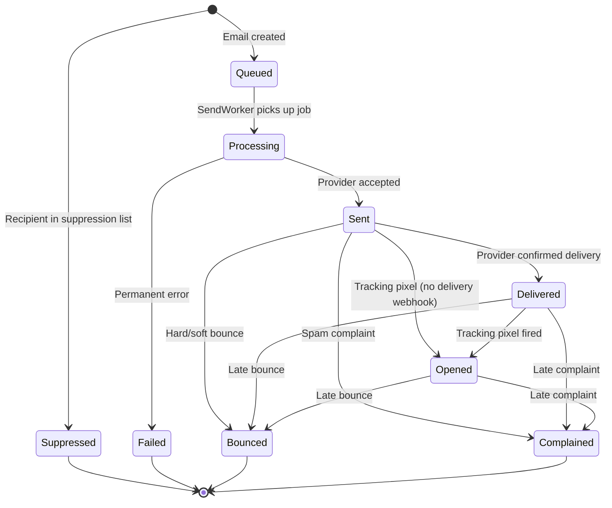
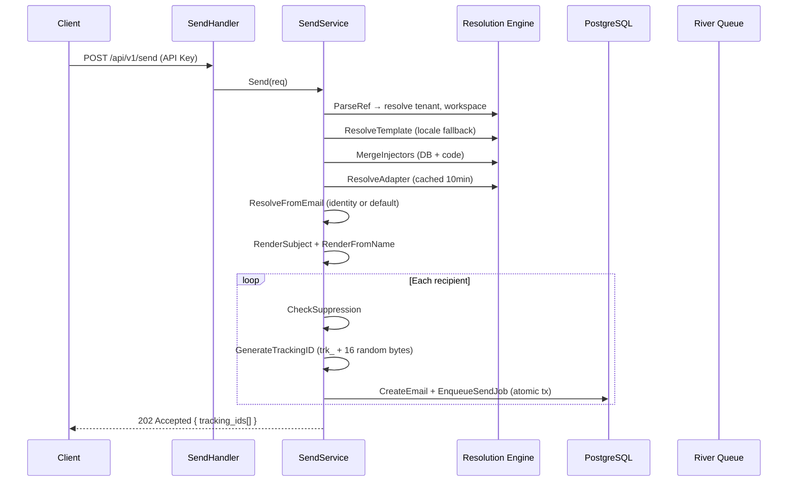
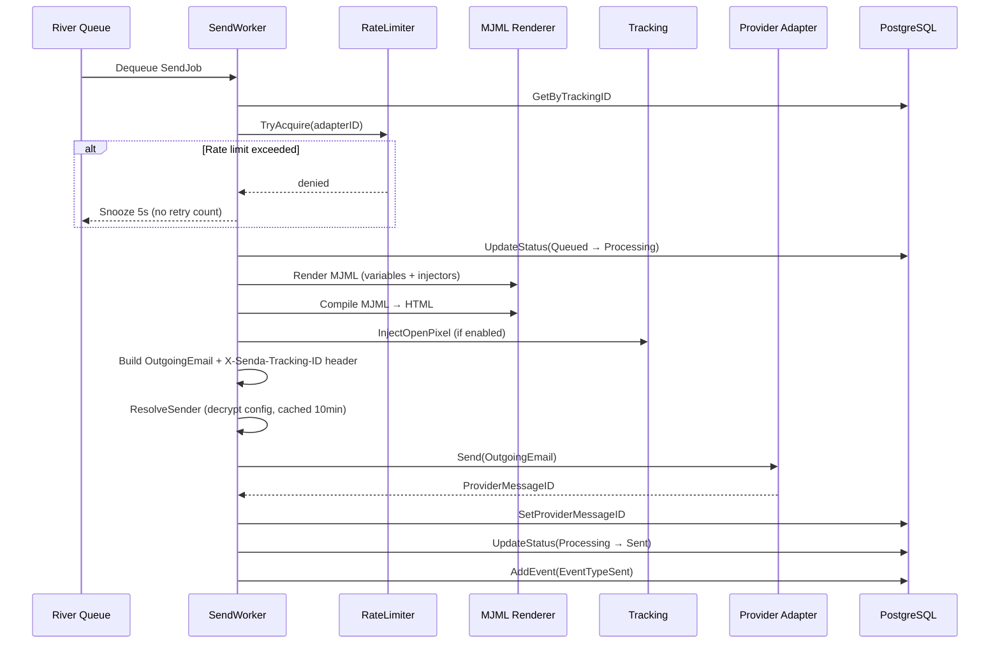
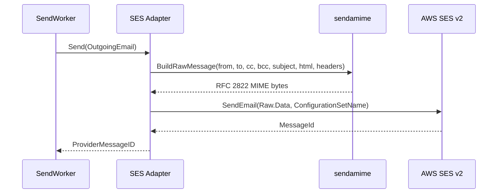
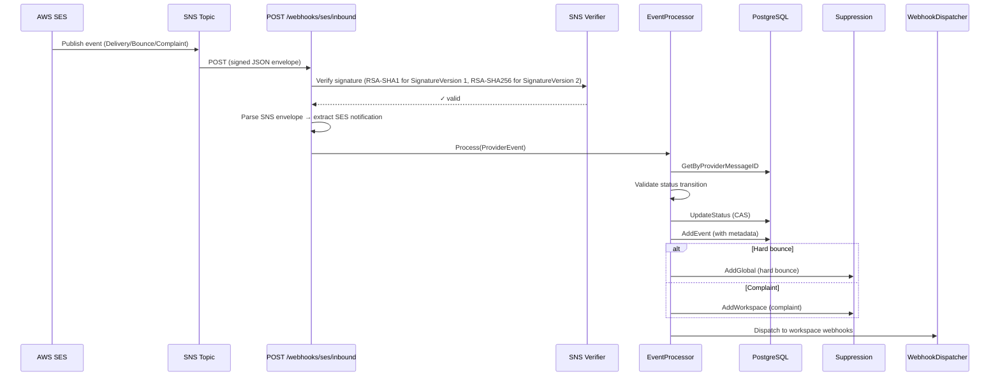
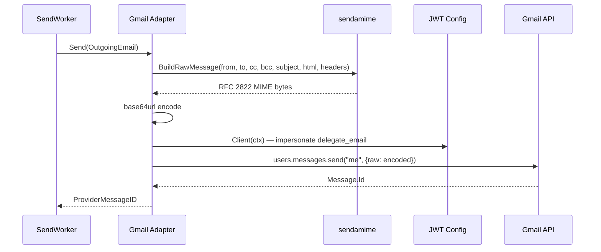
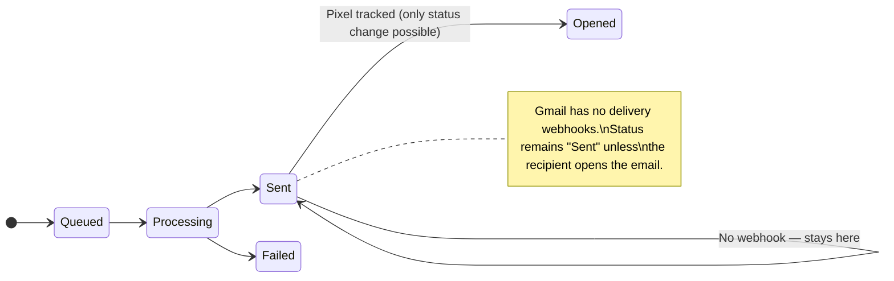
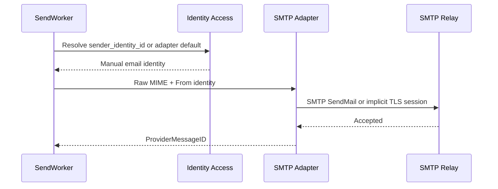
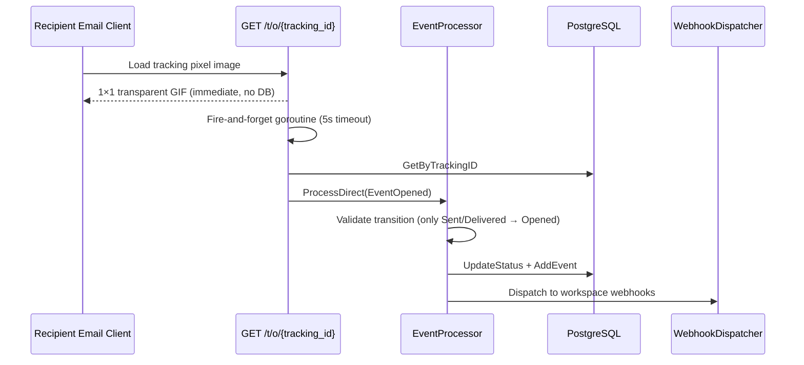
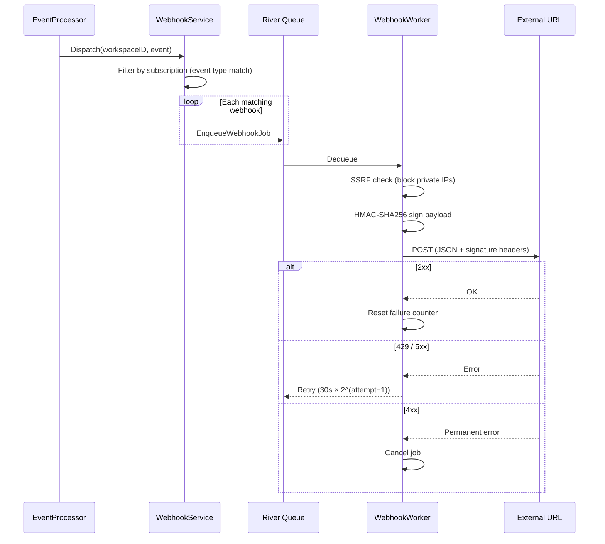

# Email Flows

> Step-by-step email lifecycle for each provider adapter.
> For the high-level sequence diagram see [README → How Sending Works](../README.md#how-sending-works).
> For the hexagonal architecture overview see [ARCHITECTURE.md](ARCHITECTURE.md).

---

## Email Status State Machine

Every email follows a forward-only state machine. Invalid transitions are silently ignored (dedup).



**Terminal states:** `Suppressed`, `Failed`, `Bounced`, `Complained`.
**Source:** `internal/service/event_processor.go` — `validTransitions` map.

---

## Common Send Pipeline

All providers share the same pipeline up to the point of calling the provider API.



### Step-by-step

1. **Parse ref** — `tenant:workspace:templateType` addressing format.
2. **Resolve chain** — tenant → workspace → template → injectors → adapter, each with inheritance fallback.
3. **Resolve sender identity** — template-level `SenderIdentityID` takes priority, otherwise adapter's default identity.
4. **Render** — subject and from-name templates rendered with request variables.
5. **Check suppression** — each recipient checked against global + workspace suppression lists.
6. **Atomic create + enqueue** — email record and River job created in a single PostgreSQL transaction. No email exists without a job, no job without an email.

### Partial failures

The API returns one of three overall statuses:
- **`accepted`** — all recipients queued successfully.
- **`partial`** — some recipients queued, others suppressed or failed. Per-recipient `status` and `error` fields indicate which.
- **error (4xx/5xx)** — all recipients failed (validation, adapter not found, etc.).

---

## SendWorker Processing

Once the job is dequeued, the worker renders and dispatches the email.



**Retry strategy:** `60s × 2^(attempt−1)` — max 5 attempts.
**Permanent errors:** job cancelled immediately (e.g., `MessageRejected`, `MailFromDomainNotVerified`).
**Transient errors:** retry with exponential backoff (increments attempt counter). On final attempt, email is marked Failed.

### Idempotency guards

The worker has three safety guards at job start:
1. **Terminal state** — if email is already Sent/Failed/Suppressed, the job is cancelled.
2. **Processing + ProviderMessageID set** — crash recovery: email was sent but status not updated. Auto-recovers to Sent.
3. **Processing + ProviderMessageID nil** — crash during send. If stale (>10 min), marked Failed. If recent, job cancelled (another worker may be in-flight).

When all 5 retry attempts are exhausted on transient errors, the email is marked as **Failed** (not left in Processing).

---

## SES Flow

### Sending

The SES adapter builds a raw MIME message and sends via the SES v2 API.



**Authentication:** AWS credentials (AccessKeyID + SecretAccessKey) per adapter.
**ConfigurationSetName:** assigned during tracking provisioning (see below), routes events to SNS.

### Delivery Tracking (SNS Webhooks)

SES pushes delivery events through an SNS → webhook pipeline.



### Step-by-step

1. **SES publishes event** — when the email is delivered, bounces, or receives a complaint, SES publishes a notification to the SNS topic linked via the Configuration Set.
2. **SNS delivers to webhook** — `POST /api/v1/webhooks/ses/inbound` receives the signed JSON envelope. No API key required (SNS signature replaces auth).
3. **Signature verification** — Verify signature (RSA-SHA1 for SignatureVersion 1, RSA-SHA256 for SignatureVersion 2) with the signing certificate fetched from `sns.{region}.amazonaws.com` (cached 1h, max 100 certs).
4. **Parse notification** — extract `notificationType` (Delivery/Bounce/Complaint), `mail.messageId`, and type-specific details (bounce type, complaint feedback, recipients).
5. **Lookup email** — match `ProviderMessageID` stored at send time.
6. **Validate transition** — only forward transitions allowed (e.g., `Sent → Delivered` ok, `Bounced → Delivered` ignored).
7. **CAS status update** — optimistic concurrency: `UPDATE ... WHERE status = expected_status`.
8. **Record event** — `EmailEvent` with timestamp, metadata (bounce type, diagnostic code, feedback ID).
9. **Suppression side-effects:**
   - **Hard bounce** → global suppression list (blocks all workspaces).
   - **Complaint** → workspace suppression list (blocks only that workspace).
10. **Dispatch workspace webhooks** — fan out to all active webhooks subscribed to this event type.

### SES event types

| Event Type | Subscribed | Handled | Notes |
|-----------|-----------|---------|-------|
| Send | ✅ | Ignored | Status already set by SendWorker |
| Delivery | ✅ | ✅ → Delivered | |
| Bounce | ✅ | ✅ → Bounced | Hard bounce → global suppression |
| Complaint | ✅ | ✅ → Complained | → workspace suppression |
| Reject | ❌ | — | Not subscribed at AWS level |
| Open | ❌ | — | Senda uses its own pixel tracking |
| Click | ❌ | — | Not implemented |
| RenderingFailure | ❌ | — | |
| DeliveryDelay | ❌ | — | |
| Subscription | ❌ | — | |

### Tracking Infrastructure Provisioning

When tracking is enabled for an SES adapter, Senda auto-provisions 5 steps:

| Step | AWS Resource | Name Pattern | Purpose |
|------|-------------|-------------|---------|
| 1 | SES Configuration Set | `senda-{adapterID[:8]}` | Routes email events to SNS |
| 2 | SNS Topic | `senda-ses-events-{adapterID[:8]}` | Receives events from SES |
| 3 | SES Event Destination | `senda-events` | Links Config Set → SNS Topic (Send, Delivery, Bounce, Complaint) |
| 4 | SNS HTTPS Subscription | `{webhookBaseURL}/api/v1/webhooks/ses/inbound` | Delivers events to Senda |
| 5 | DB Update | Adapter encrypted config | Persists `configuration_set_name` into adapter config |

SNS sends a `SubscriptionConfirmation` message first. Senda auto-confirms after SSRF-validating the `SubscribeURL`.

**Source:** `internal/adapter/ses/tracking_provisioner.go`.

---

## Gmail Flow

### Sending

The Gmail adapter uses a **Google Service Account with domain-wide delegation** to send as the delegate email.



**Authentication:** Service Account JSON key + `Subject` set to `delegate_email` for domain-wide delegation.
**Scopes:** `gmail.send`, `gmail.settings.basic` (for identity listing).

### Delivery Tracking Limitations

> **⚠️ Gmail does NOT provide delivery webhooks.**

Unlike SES, Gmail has no push notification system for delivery/bounce/complaint events. After sending:

- Status stays at **Sent** indefinitely (unless an open is tracked).
- **Open tracking** works via the same pixel mechanism as SES.
- **Bounces** — Gmail generates bounce-back emails to the sender, but Senda does not currently poll the inbox for them.
- **Complaints** — Gmail does not expose spam reports to senders.

> **Future enhancement**: Gmail does offer a [Push Notifications API](https://developers.google.com/gmail/api/guides/push) via `users.watch` + Cloud Pub/Sub that could detect bounce-back NDR messages landing in the sender's inbox. This is not currently implemented but could provide partial bounce detection for Gmail adapters.



---

## SMTP Flow

The SMTP adapter uses relay-only configuration (`host`, `port`, `tls_mode`, optional `auth_mode`, optional credentials). It does not store `from_email` or `from_name` in adapter config.

Sender addresses are manual `AdapterIdentity` email records:

1. Create the SMTP adapter with relay config.
2. Create one or more manual sender email identities on that adapter.
3. Mark a default identity or select `sender_identity_id` on the template type.
4. For system-owned SMTP adapters, grant specific email identities to child workspaces.

SMTP has no provider identity sync and no provider delivery webhooks. After the relay accepts the message, Senda records the email as `Sent`; later state changes come only from open tracking or internal failure handling.



---

## Open Tracking (All Providers)

Open tracking works identically across SES, Gmail, and SMTP.



### How it works

1. **At send time** — if `OpenTrackingEnabled`, the worker injects `` before `</body>`.
2. **On open** — the recipient's email client loads the image, hitting the tracking endpoint.
3. **Immediate response** — a 1×1 transparent GIF is returned instantly (no database call in the hot path).
4. **Async processing** — a fire-and-forget goroutine records the open event with a 5-second context timeout.
5. **Transition guard** — only updates status if email is in `Sent` or `Delivered`. Won't overwrite `Bounced`/`Complained`.

A third suppression reason, **manual**, allows administrators to suppress addresses via the API at both global and workspace levels.

**Source:** `internal/http/handler/tracking.go`, `internal/tracking/pixel.go`.

---

## Webhook Delivery

When an email event occurs, Senda can notify external systems via workspace webhooks.



### Signature headers

| Header | Value |
|--------|-------|
| `X-Senda-Event` | Event type (e.g., `email.delivered`) |
| `X-Senda-Signature` | `sha256=hex(HMAC(secret, timestamp.payload))` |
| `X-Senda-Timestamp` | Unix timestamp |
| `User-Agent` | `Senda-Webhook/1.0` |

**Retry:** `30s × 2^(attempt−1)` — max 6 attempts.
**Auto-disable:** webhook deactivated after 10 consecutive failures.

---

## Observability

### Prometheus metrics

| Metric | Type | Labels | Description |
|--------|------|--------|-------------|
| `senda_emails_enqueued_total` | Counter | — | Emails accepted and queued |
| `senda_emails_sent_total` | Counter | adapter, tenant, workspace | Emails successfully sent to provider |
| `senda_emails_failed_total` | Counter | — | Emails that failed permanently |
| `senda_email_send_duration_seconds` | Histogram | adapter | Time from worker pickup to provider response |
| `senda_provider_errors_total` | Counter | adapter, error_type | Provider send errors (permanent/transient) |
| `senda_bounce_rate` | Gauge | tenant, workspace, bounce_type | Bounce/complaint events by type |
| `senda_http_request_duration_seconds` | Histogram | method, path, status | HTTP request latency |
| `senda_http_requests_total` | Counter | method, path, status | HTTP request count |

### Structured logging

All log entries include `request_id` (from `X-Request-ID` header). The send worker and event processor include `email_id` and `tracking_id` in all structured log fields, enabling correlation between API responses (which return `tracking_id`) and backend logs.

### Correlation chain

```
API request (X-Request-ID) → tracking_id → email_id → provider_message_id → webhook events
```

To trace an email end-to-end: query by `tracking_id` via `GET /api/v1/emails/:tracking_id` (returns email record + all events).

---

## Provider Comparison

| Capability | SES | Gmail | SMTP |
|-----------|-----|-------|------|
| **Authentication** | AWS AccessKey + SecretKey | Service Account (domain-wide delegation) | Optional PLAIN/LOGIN relay auth |
| **Delivery webhooks** | ✅ via SNS (Delivered, Bounce, Complaint) | ❌ Not available | ❌ Not available |
| **Open tracking** | ✅ Pixel injection | ✅ Pixel injection | ✅ Pixel injection |
| **Bounce detection** | ✅ Real-time via webhook | ❌ Bounce-back email only | ❌ Bounce-back email only |
| **Complaint detection** | ✅ Real-time via webhook | ❌ Not exposed | ❌ Not exposed |
| **Rate limiting** | Token bucket (configurable per adapter) | Token bucket (configurable per adapter) | Token bucket (configurable per adapter) |
| **Identity sync** | ✅ SES `ListEmailIdentities` (email + domain) | ✅ Gmail `ListSendAs` (email only) | ❌ Manual only |
| **Tracking provisioning** | ✅ Auto (ConfigSet + SNS + subscription) | ❌ No infrastructure needed | ❌ No infrastructure needed |
| **Error classification** | Smithy API error codes | HTTP status codes (4xx/5xx) | SMTP reply codes |
| **Message format** | Raw MIME via `sendamime` | Raw MIME → base64url via `sendamime` | Raw MIME via `sendamime` |

---

## Key Source Files

| Component | Path |
|-----------|------|
| Email domain model | `internal/domain/email.go` |
| Status transitions | `internal/service/event_processor.go` |
| Send worker | `internal/adapter/river/send_worker.go` |
| SES adapter | `internal/adapter/ses/adapter.go` |
| SES tracking provisioner | `internal/adapter/ses/tracking_provisioner.go` |
| Gmail adapter | `internal/adapter/gmail/adapter.go` |
| SMTP adapter | `internal/adapter/smtp/adapter.go` |
| SNS signature verifier | `internal/adapter/sns/verifier.go` |
| SES webhook handler | `internal/http/handler/provider_webhook.go` |
| Open tracking handler | `internal/http/handler/tracking.go` |
| Pixel injection | `internal/tracking/pixel.go` |
| Webhook delivery worker | `internal/adapter/river/webhook_worker.go` |
| Webhook service | `internal/service/webhook.go` |
| Shared MIME builder | `internal/adapter/sendamime/` |
| Identity service | `internal/service/identity.go` |
| Send service + from address resolution (`resolveFromEmail`) | `internal/service/send.go` |
| Email query handler | `internal/http/handler/email.go` |
| Data plane email handler | `internal/http/handler/data_plane_email.go` |
| Send response types | `internal/http/response/send.go` |
| Email response types | `internal/http/response/email.go` |
| Prometheus metrics | `internal/metrics/metrics.go` |
| Request ID middleware | `internal/http/middleware/requestid.go` |
| Provider event domain | `internal/domain/provider_event.go` |
| Unsubscribe service | `internal/service/unsubscribe.go` |
| Unsubscribe HTTP handler | `internal/http/handler/unsubscribe.go` |
| Template-type subscription store | `internal/adapter/postgres/template_type_subscription_repo.go` |

---

## Unsubscribe

When a `template_type` has `is_bulk = true`, every send for that type carries:

- HTTP header `List-Unsubscribe: <https://<base>/api/v1/u/{token}>` (RFC 2369)
- HTTP header `List-Unsubscribe-Post: List-Unsubscribe=One-Click` (RFC 8058)
- Two template variables resolvable in MJML: `{{ system.unsubscribe_url }}` and `{{ system.preferences_url }}`

The token is HMAC-SHA256 over a JSON payload (`v`, `ws`, `tt`, `ttn`, `e`, `eid`, `iat`, `exp`) signed
with the per-workspace key stored in `workspaces.unsubscribe_signing_key`. Tokens expire 12 months
after issue.

Suppression has three levels checked in cascade by `SuppressionBatchEvaluator.EvaluateForType`:

1. **`suppression_global`** — hard bounce / complaint anywhere.
2. **`suppression_workspace`** — opt-out-all (`reason='unsubscribe'`) or admin block.
3. **`template_type_subscription`** — per-type opt-out from preference center or one-click.

The first match blocks the send. `template_type` transactional sends (where `is_bulk = false`) are
**never** blocked by level 3 and **never** carry the `List-Unsubscribe` header.

Recipients can self-service:

- `POST /api/v1/u/{token}` — one-click opt-out from this type (RFC 8058).
- `POST /api/v1/u/{token}/all` — opt-out from all types in this workspace.
- `POST /api/v1/u/{token}/resubscribe` — undo opt-out-all (does NOT undo hard_bounce/complaint).
- `GET  /api/v1/u/{token}/preferences` — list types received in last 12 months + state.
- `POST /api/v1/u/{token}/preferences` — flip subscription state per type.

The browser-facing pages live in Next.js: `/u/{token}` (single-event vs all radio), `/u/{token}/preferences`
(checkbox-per-type center).
