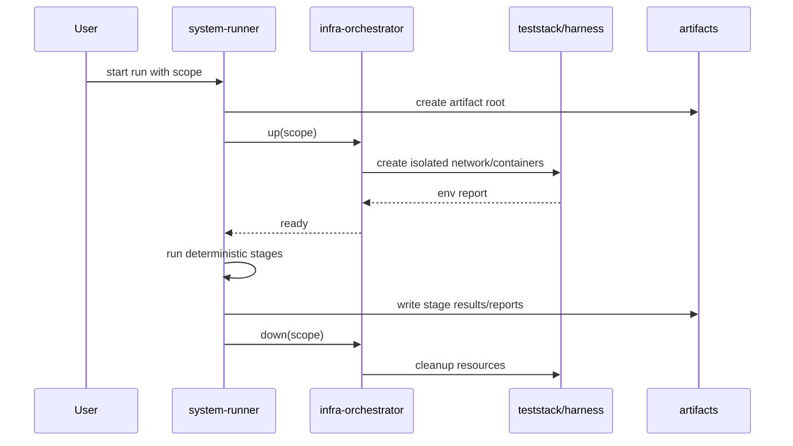

# Design — Autonomous E2E Isolation

## Objetivo técnico

Hacer que E2E/system pueda correr en paralelo sin colisiones de recursos ni de artefactos, manteniendo un camino determinístico por defecto y dejando los stages pesados como opt-in.

## Estrategia

1. Introducir un identificador de scope por ejecución: `spec + worktree + mode + run`.
2. Derivar de ese scope nombres únicos pero legibles para:
   - red Docker
   - contenedores Postgres/Mailpit/App/Keycloak/AWS sim
   - directorio raíz de artefactos
   - archivos de reporte por etapa
3. Mantener cleanup como contrato obligatorio, no como mejor esfuerzo.
4. Separar el runner determinístico de los stages pesados por flags explícitos.

## Modelo de nombres

Preferencia:

`senda-{suite}-{spec}-{worktree}-{mode}-{short-hash}`

Tradeoff:
- **Ventaja:** trazabilidad humana y baja probabilidad de colisión.
- **Costo:** requiere una función de derivación común para evitar divergencias entre harness, stack y runner.

Para recursos efímeros de una sola ejecución, el hash debe provenir del scope normalizado, no del clock.

## Puntos del código a tocar

- `test/e2e/harness_test.go`
  - quitar dependencia de nombres globales
  - inyectar scope por spec/worktree
  - hacer únicos red/contenerores
- `internal/teststack/stack.go`
  - reemplazar prefijos fijos `senda-stack-pr-*` / `nightly-*`
  - propagar el scope al reporte runtime
- `test/system/system-runner.sh`
  - parametrizar `ARTIFACT_DIR`, `STAGES_DIR`, `ENV_REPORT`
  - conservar cleanup aun en fallos
  - mantener heavy stages fuera del camino por defecto
- orquestación auxiliar de infra
  - asegurar que “up” y “down” usan el mismo scope canónico

## Flujo

## Tradeoffs

- **Deterministic naming** facilita debugging, pero obliga a controlar bien el hash.
- **Random-only naming** simplifica colisiones, pero empeora operación y limpieza.
- **Heavy stages opt-in** protege el camino normal; el costo es que la cobertura profunda requiere un modo explícito de ejecución.

## Ownership

- El runner controla el contrato de artefactos.
- El stack/harness controla identidad de recursos.
- El cierre de recursos es responsabilidad compartida, pero el scope debe viajar igual en ambas direcciones.
