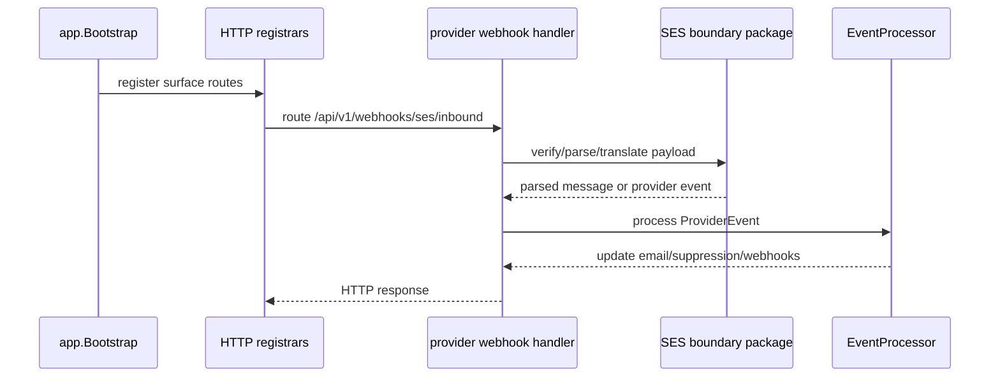

# Design: composition-boundary-slimming

## Technical Approach

La estrategia es dividir la composición en tres límites claros:

1. **Composition root mínimo**: `internal/app/app.go` conserva solo el wiring compartido, la creación de dependencias comunes y la delegación a ensambladores auxiliares.
2. **Router particionado por superficie**: `internal/http/server.go` deja de concentrar todo el árbol de rutas y pasa a invocar registradores pequeños y enfocados por superficie.
3. **Boundary SES provider-specific**: `internal/http/handler/provider_webhook.go` deja de conocer el parsing y la traducción SES; esa lógica se mueve a un paquete específico de SES, manteniendo el handler como adaptador de transporte y coordinación.

Esto no es una optimización cosmética. Si la frontera sigue borrosa, el sistema seguirá siendo difícil de razonar y cualquier nuevo cambio volverá a inflar los mismos archivos.

## Architecture Decisions

### Decision 1: composition root mínimo
**Choice**: separar el wiring de infraestructura compartida del wiring específico por superficie o por proveedor.

**Why**: `app.go` hoy mezcla demasiadas responsabilidades y eso convierte cada cambio de wiring en una lectura lateralmente costosa.

**Tradeoff**: más helpers y más archivos, pero una composición mucho más comprensible.

### Decision 2: registradores por superficie
**Choice**: mover el registro de rutas a funciones dedicadas por superficie, por ejemplo `management`, `data-plane`, `external-integration`, `public` y `provider-webhook`.

**Why**: `server.go` ya no debe ser el punto donde todo cabe; la ownership de cada ruta debe ser visible por archivo y por función.

**Tradeoff**: el arranque del servidor agrega un salto más de indirection, pero el mantenimiento gana claridad y testeabilidad.

### Decision 3: SES parsing fuera del handler HTTP
**Choice**: crear un boundary provider-specific para SNS/SES que encapsule envelope parsing, validation, timestamp parsing y traducción a `domain.ProviderEvent`.

**Why**: el handler HTTP debe leer body, verificar firma, delegar y responder; no debería saber cómo se interpreta un evento SES.

**Tradeoff**: se introduce un paquete más, pero el handler queda mucho más fino y el conocimiento SES queda donde corresponde.

### Decision 4: validación por slices representativos
**Choice**: validar el cambio con unit tests focalizados y con slices representativos/E2E autónoma en lugar de intentar una cobertura puramente estructural de todos los archivos.

**Why**: el objetivo es demostrar boundaries más limpios sin regresión funcional, no medir el número de líneas por archivo.

**Tradeoff**: la señal es más semántica que mecánica, pero es exactamente la señal que importa aquí.

## Data Flow



## File Changes

| File | Action | Description |
|------|--------|-------------|
| `internal/app/app.go` | Modify | Reducir el bootstrapping inline y delegar el wiring a helpers explícitos. |
| `internal/app/bootstrap.go` | Create | Helpers de composición para dependencias compartidas y bundles por superficie. |
| `internal/http/server.go` | Modify | Convertir el switchboard en un entrypoint pequeño que delega el registro de rutas. |
| `internal/http/routes_management.go` | Create | Registrar la superficie de management. |
| `internal/http/routes_dataplane.go` | Create | Registrar la superficie de data-plane. |
| `internal/http/routes_external.go` | Create | Registrar la superficie de external-integration. |
| `internal/http/routes_public.go` | Create | Registrar rutas públicas/health/tracking/media. |
| `internal/http/routes_provider.go` | Create | Registrar webhooks de provider, incluyendo SES inbound. |
| `internal/http/handler/provider_webhook.go` | Modify | Quitar parsing/mapping SES y dejar coordinación HTTP pura. |
| `internal/adapter/ses/webhook/*.go` | Create | Encapsular parsing SNS/SES, timestamps y traducción a `ProviderEvent`. |
| `internal/app/app_test.go` | Create/Modify | Probar que el bootstrap sigue ensamblando correctamente sin reintroducir el acoplamiento. |
| `internal/http/server_test.go` | Modify | Asegurar que la partición por superficie preserva el contrato de rutas. |
| `internal/http/handler/provider_webhook_test.go` | Modify | Probar la frontera nueva con casos SES representativos. |
| `internal/adapter/ses/webhook/*_test.go` | Create | Probar mapping SES: delivery, bounce, complaint y subscription confirmation. |

## Interfaces / Contracts

La frontera nueva debe quedar conceptualmente así:

```go
type ParsedMessage struct {
    Kind         string
    TopicArn     string
    SubscribeURL string
    Event        *domain.ProviderEvent
}

type Translator interface {
    Translate(rawBody []byte) (*ParsedMessage, error)
}
```

El handler HTTP no debe construir `domain.ProviderEvent` por sí mismo. Solo debe:

1. leer el body,
2. validar o verificar la firma,
3. pedir la traducción al boundary SES,
4. confirmar suscripciones cuando corresponda,
5. delegar al `EventProcessor`.

## Testing Strategy

| Layer | What to Test | Evidence Expected |
|-------|--------------|-------------------|
| Unit | Bootstrap mínimo y helpers de composición | El wiring se arma igual, pero sin crecimiento del root. |
| Unit | Registradores de rutas por superficie | Los grupos quedan legibles y el contrato de rutas se preserva. |
| Unit | Boundary SES provider-specific | Delivery, bounce, complaint y subscription confirmation se traducen correctamente. |
| Slice / E2E autónoma | Flujos representativos del router y del inbound SES | Management, data-plane, external integration y SES inbound siguen funcionando sin regresión. |

## Rollout / Rollback

No hay migración de datos. Si aparece regresión, el cambio se revierte por capas:

1. restaurar el registro inline de rutas,
2. volver a la lógica SES en el handler,
3. mantener el bootstrap compartido intacto hasta que el refactor esté listo.

## Non-Goals

- No se introduce un contenedor DI generalizado.
- No se cambia el modelo de permisos.
- No se modifica el contrato externo de SES.
- No se aprovecha el refactor para hacer rediseños de negocio ajenos a la frontera de composición.
