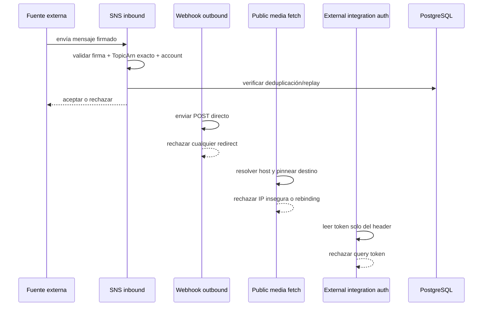

# Design — Hardening del perímetro de seguridad

## Objetivo técnico

Cerrar los bordes de confianza para que cada entrada o salida pase por una política explícita, verificable y deny-by-default.

## Modelo de confianza

El sistema debe tratar como **no confiable** todo lo que venga de:

- SNS / SES inbound.
- Webhooks outbound hacia terceros.
- URLs públicas de media.
- Tokens transmitidos por medios alternativos al header.

Solo pasan los flujos que cumplan una política explícita de identidad, destino y transporte.

## Decisiones de diseño

### 1) SNS inbound: binding exacto al destino esperado

La verificación no debe detenerse en `arn:aws:sns:`. Debe comparar el `TopicArn` completo contra un valor esperado configurado y validar que la cuenta del ARN también coincida con la esperada.

Además, el flujo debe incorporar anti-replay/deduplicación explícitos:

- clave de deduplicación: `TopicArn + MessageId`
- ventana de replay configurable
- rechazo de duplicados aunque la firma sea válida

Esto convierte el webhook en un contrato de destino estricto, no en un receptor genérico de SNS.

### 2) Webhooks outbound: sin redirects automáticos

La opción más segura es rechazar cualquier redirect HTTP en la entrega outbound.

Tradeoff:

- **Ventaja:** reduce la superficie SSRF y elimina ambigüedad de política.
- **Costo:** endpoints que dependan de 3xx tendrán que exponer URL final directa.

Si en el futuro se necesita soporte para redirects, debe ser un modo explícito con revalidación por hop y misma política SSRF. No debe ser el comportamiento por defecto.

### 3) Media pública: allowlist + pinning

La descarga de media no puede depender solo de resolver el host “en el momento”. Hay que pinnear el destino para el request completo:

- resolver el host al inicio
- rechazar direcciones loopback, privadas, link-local, reservadas o no resolubles
- fijar la IP válida elegida para la conexión
- revalidar cada redirect contra la misma política
- bloquear cualquier salto a un host no permitido

Esto cierra la ventana de DNS rebinding que la validación puntual no elimina.

### 4) Integraciones externas: token por header בלבד

El token debe venir solo por el header dedicado `x-senda-external-token`.

No se acepta `?token=`. Esa ruta debe desaparecer por completo para evitar exposición accidental en logs, referers, caches y tooling intermedio.

## Cambios de configuración y persistencia

### Configuración

Se necesita un bloque explícito de security policy para que la seguridad no dependa de supuestos implícitos. El diseño debe contemplar:

- `sns.expected_topic_arn`
- `sns.expected_account_id`
- `sns.replay_window`
- `webhooks.redirect_policy = deny`
- `media.allowed_hosts`
- `media.pin_resolved_destination = true`

Si un valor crítico falta, el sistema debe fallar rápido en startup o en la primera petición, según el punto donde se pueda validar de forma segura.

### Persistencia

La deduplicación/replay de SNS necesita estado durable en PostgreSQL. El diseño debe usar una tabla con clave única por `TopicArn + MessageId` y una marca temporal para expiración/limpieza.

No se introduce Redis ni almacenamiento efímero adicional.

## Puntos del código a tocar

- `internal/http/handler/provider_webhook.go`
  - comparar `TopicArn` exacto
  - rechazar cuenta distinta
  - integrar dedup/replay
- `internal/adapter/river/webhook_worker.go`
  - bloquear redirects explícitamente
  - registrar una falla permanente si el upstream intenta redirigir
- `internal/http/handler/media.go`
  - introducir pinning del destino resuelto
  - reforzar la política deny-by-default
- `internal/http/middleware/external_integration.go`
  - eliminar fallback a query string
  - dejar el header como único transporte
- `internal/port` / `internal/service` / `internal/adapter/postgres`
  - agregar contrato y almacenamiento para deduplicación/replay
- migraciones
  - persistencia del anti-replay
- tests
  - negativos de seguridad y E2E de validación

## Flujo de verificación

## Verificación final E2E

La verificación final debe demostrar cuatro cosas al mismo tiempo:

1. Un SNS válido entra y uno falso no.
2. Un replay no se procesa dos veces.
3. Un webhook con redirect falla.
4. Un fetch de media o integración externa fuera de política falla.

El criterio de aceptación no es “no rompió tests”, sino que cada borde de confianza quede probado con un caso positivo y varios negativos.

## Tradeoffs

- **Bloquear redirects** simplifica la política y reduce riesgo. El costo es romper algunos endpoints legados.
- **Pinning** agrega complejidad de transporte, pero es la única forma correcta de cerrar rebinding.
- **Persistir replay** en PostgreSQL introduce escritura adicional, pero evita depender de memoria local o caches no durables.

## Ownership

- `provider_webhook.go` y el anti-replay son responsabilidad del perímetro de inbound.
- `webhook_worker.go` es responsable del perímetro outbound.
- `media.go` es responsable del fetch público.
- `external_integration.go` es responsable del transporte de credenciales.
