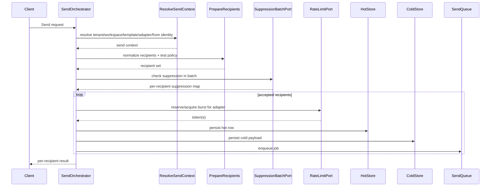
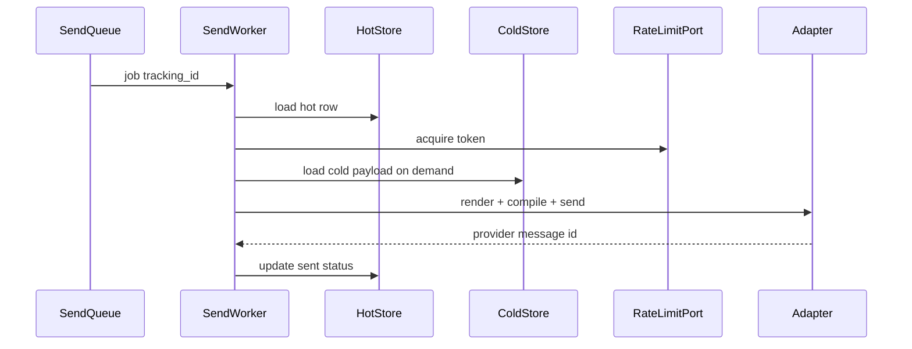

# Design — Send Core Rework

## Objetivo técnico

Separar el core de envío en límites explícitos, bajar el costo del hot path y hacer que la persistencia refleje esa separación. El diseño debe preservar el comportamiento funcional actual, pero no debe proteger retrocompatibilidad interna si eso bloquea la corrección estructural.

## Arquitectura objetivo

### Capas

#### 1. Orquestación de aplicación

Un orquestador de envío debe coordinar el flujo completo sin cargar con los detalles de SQL, colas ni reglas de almacenamiento. Su responsabilidad es ensamblar el caso de uso.

Responsabilidades:

- resolver tenant, workspace, template y adapter,
- aplicar políticas de test recipients,
- normalizar los destinatarios,
- delegar la supresión en batch,
- construir el modelo de persistencia,
- persistir y encolar atómicamente,
- devolver un resultado por destinatario.

#### 2. Use cases explícitos

Proponemos límites claros, cada uno testeable de forma independiente:

- **ResolveSendContext**: resuelve tenant/workspace/template/adapter/from identity/locale.
- **PrepareRecipients**: normaliza `to`, `cc` y `bcc`, y aplica política de test recipients.
- **EvaluateSuppressionBatch**: consulta supresión para múltiples direcciones de una sola vez.
- **PersistSendAcceptance**: persiste fila operativa, evento y job.
- **PersistSuppressedSend**: persiste la decisión de supresión y su evento asociado.
- **LoadEmailForWorker**: carga el payload frío cuando el worker realmente lo necesita.

#### 3. Puertos

Los puertos deben reflejar la separación de responsabilidades:

- `TenantLookupPort`
- `WorkspaceLookupPort`
- `TemplateResolutionPort`
- `InjectorResolutionPort`
- `AdapterResolutionPort`
- `SuppressionBatchPort`
- `RateLimitPort`
- `EmailHotStorePort`
- `EmailPayloadStorePort`
- `SendQueuePort`

## Estrategia de hot path

### 1. Supresión batched

La evaluación de supresión no debe caminar uno por uno por cada destinatario. El port debe aceptar una lista normalizada y devolver un mapa de resultados por email.

La implementación en PostgreSQL debe usar una única consulta set-based por workspace para resolver global + workspace suppression en lote.

Tradeoff:

- **Ventaja:** menos round-trips, menos latencia y menos contención.
- **Costo:** la query es más compleja y requiere un contrato de salida bien definido.

### 2. Rate limit menos contencioso

`take_send_token()` hoy serializa más de la cuenta porque cada worker compite por el mismo bloque con `FOR UPDATE`. El nuevo diseño debe mover la adquisición a un modelo de reserva o lote pequeño por adapter, de forma que no haya una carrera por mensaje.

Preferencia de diseño:

- API de reserva/burst por adapter,
- una sola sección crítica por reserva,
- cumplimiento exacto del límite por adapter,
- contención menor bajo 30 workers concurrentes.

Tradeoff:

- **Ventaja:** reduce lock contention en la ruta caliente.
- **Costo:** agrega estado de reserva y requiere pruebas más estrictas para no sobrepasar el límite.

### 3. Skinny rows

La fila operativa no debe cargar el payload frío completo.

El split propuesto es:

- **Hot row**: identidad operativa, status, tracking, tenant/workspace, adapter, retry state, timestamps y campos mínimos para list/detail operativo.
- **Cold payload**: snapshots y contenido amplio que el worker necesita para renderizar o reconstruir el mensaje.

Esto reduce el tamaño de la fila más consultada y mejora cache locality, I/O y costo de lectura para listados y worker bootstrap.

Tradeoff:

- **Ventaja:** menos ancho de fila y menos trabajo en la ruta crítica.
- **Costo:** más joins/lecturas diferidas cuando un consumidor necesita el payload frío.

## Flujo objetivo

## Opciones evaluadas

### Opción A: Extraer helpers dentro de `SendService`

- Pros: rápida, poco cambio de archivos.
- Contras: no resuelve el núcleo del problema; el límite sigue difuso.

### Opción B: Crear una fachada nueva pero conservar el monolito debajo

- Pros: mejora aparente del API interno.
- Contras: duplica conceptos y oculta acoplamiento.

### Opción C: Partir el core en use cases y puertos explícitos

- Pros: corrige estructura y permite optimizar el hot path con intención.
- Contras: exige migración interna más amplia.

La opción C es la elegida.

## Puntos del código a tocar

### Orquestación y casos de uso

- `internal/service/send.go`
- nuevos archivos/paquetes de aplicación para separar el orquestador y los use cases
- `internal/service/send_test.go`

### Persistencia y rate limiting

- `internal/adapter/postgres/email_repo.go`
- `internal/adapter/postgres/suppression_repo.go`
- `internal/adapter/postgres/rate_limiter.go`
- nuevas migraciones bajo `migrations/`

### Worker

- `internal/adapter/river/send_worker.go`
- tests del worker en `internal/adapter/river/send_worker_test.go`

### Dominio y puertos

- `internal/domain/email.go`
- `internal/port/store.go`
- puertos nuevos o refinados para batch suppression y payload split

## Estrategia de migración interna

No se va a preservar retrocompatibilidad interna en la implementación del core. El cambio debe migrar de una vez la orquestación, los puertos y la persistencia para evitar una doble fuente de verdad.

Estrategia:

1. Definir los nuevos puertos y estructuras de input/output.
2. Reescribir la orquestación del envío sobre esos límites.
3. Introducir el split hot/cold en la persistencia.
4. Adaptar el worker para leer el payload frío solo cuando sea necesario.
5. Eliminar la ruta antigua una vez que el nuevo camino cubra la validación y los tests.

Esto evita mantener dos implementaciones vivas al mismo tiempo.

## Validación técnica

La validación debe incluir tres niveles:

1. **Unit tests** para los use cases nuevos.
2. **Integration tests** para SQL set-based, persistencia hot/cold y rate limiting.
3. **Bench funcional** para comparar el hot path antes y después.

El benchmark debe reportar, como mínimo:

- tiempo por envío aceptado,
- round-trips a PostgreSQL,
- contención/espera de lock en rate limit,
- costo de supresión por lote,
- tamaño de fila operativa y costo de lectura.

## Ownership

- **Application layer**: orquestación y reglas de negocio del envío.
- **PostgreSQL adapter**: batch suppression, rate limit, split de persistencia.
- **River worker**: ejecución del envío usando hot row + cold payload.
- **Migrations**: esquema y backfill.
