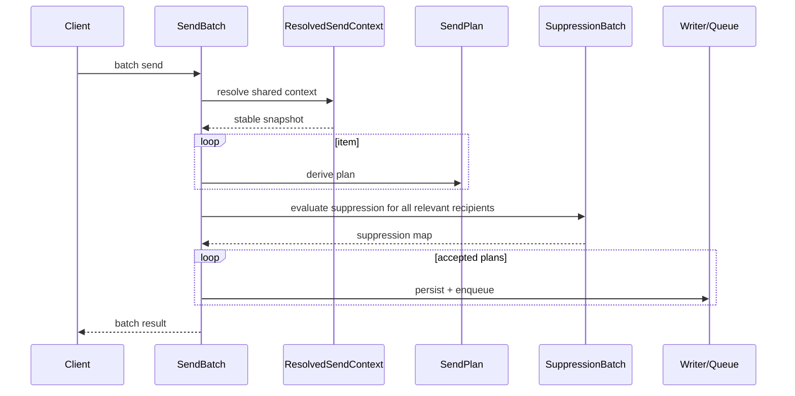

# Design — Amortización del send path y precisión de cache

## Objetivo técnico

Bajar el costo real de la ruta crítica de envío sin cambiar la semántica funcional:

- resolver una sola vez lo estable,
- derivar planes por item sin repetir trabajo global,
- eliminar consultas N+1 en revocación de grants,
- invalidar cache con precisión de scope y clave,
- medir el hot path con benchmarks comparables.

## Arquitectura objetivo

### 1. `ResolvedSendContext`

`ResolvedSendContext` es el snapshot inmutable de todo lo que no debería recalcularse por item dentro de una misma operación de envío.

Debe contener, como mínimo:

- tenant y workspace resueltos,
- template resuelto y su versión efectiva,
- adapter resuelto,
- identidad de envío efectiva,
- locale efectivo y fallback aplicado,
- renderer/injector state estable,
- datos de policy que no cambian dentro del lote.

Su valor es simple: si tres items de un batch comparten el mismo origen lógico, no deberían pasar tres veces por la misma resolución pesada.

### 2. `SendPlan`

`SendPlan` es la unidad de ejecución por item lógico. Se construye a partir de `ResolvedSendContext` + datos específicos del item.

Debe contener:

- destinatarios efectivos del item,
- variables y overrides del item,
- external ID y source metadata,
- flags de suppressión y test policy derivadas para ese item,
- referencias al payload que sí cambia por item.

La regla es estricta: lo que no varía entre items no vive en el plan; lo variable no contamina el contexto compartido.

### 3. `SendBatch` amortizado

El flujo objetivo de `SendBatch` no es “llamar `Send` N veces”.

El flujo correcto es:

1. resolver el contexto compartido una vez,
2. normalizar y agrupar los items,
3. derivar un `SendPlan` por item,
4. ejecutar una sola evaluación set-based de suppressión para el conjunto relevante,
5. persistir/enqueue con el plan correcto por item.

Esto conserva cardinalidad funcional, pero elimina repetición innecesaria.

## Revocación set-based

### Problema actual

`ReplaceAdapterWorkspaceAccess` y `ReplaceIdentityWorkspaceAccess` calculan el conjunto revocado y luego consultan uso por workspace uno por uno. Eso introduce una cascada de queries y hace que el costo crezca con la cantidad de workspaces afectados.

### Diseño propuesto

La revocación debe dividirse en dos pasos claros:

1. calcular en memoria el diff entre grants actuales y grants deseados,
2. consultar en una sola operación set-based si alguno de los revocados está en uso.

La capa de persistencia debe exponer una consulta que acepte el conjunto completo de candidatos y devuelva, en una sola respuesta, cuáles están en uso y por qué.

Preferencia de contrato:

- un port explícito para validar uso de grants revocados por conjunto,
- una sola query PostgreSQL con `ANY(...)`, `JOIN` o `GROUP BY` según convenga,
- una sola escritura para reemplazar grants una vez validado el conjunto.

Tradeoff:

- **Ventaja:** elimina N+1, reduce latencia y simplifica el perfil de carga.
- **Costo:** la query es más compleja y necesita pruebas de integración estrictas.

## Invalidación de cache precisa

### Problema actual

La invalidación por prefijo usa una forma de borrado demasiado amplia para la semántica del hot path. `DELETE ... LIKE` es fácil de escribir, pero caro de razonar: borra más de lo que el caso de uso normalmente necesita y no deja claro el scope real del impacto.

### Diseño propuesto

La invalidación debe pasar de “borrar por patrón” a “borrar por clave conocida y scope conocido”.

Eso implica:

- claves de cache estructuradas,
- constructores de clave centralizados,
- invalidadores específicos por entidad o por scope,
- uso de listas exactas de claves cuando el cambio afecta más de una entrada,
- mantener el borrado por prefijo solo como herramienta de mantenimiento, no como ruta caliente.

El criterio de diseño es directo: si sabemos exactamente qué se invalida, no debemos pedirle a PostgreSQL que adivine mediante un `LIKE`.

### Tradeoff

- **Ventaja:** menos barrido accidental, menos trabajo de GC lógico, semántica más predecible.
- **Costo:** exige disciplina en la generación y administración de claves.

## Benchmarks y medición

La benchmark suite debe medir el hot path de forma separada y acumulativa:

| Benchmark | Qué mide | Esperado |
| --- | --- | --- |
| `BenchmarkResolvedSendContext` | costo de resolución estable | pocas allocs y bajo tiempo por contexto |
| `BenchmarkSendBatchAmortized` | lote completo con reutilización | menos tiempo por item que la ruta item-by-item |
| `BenchmarkGrantRevocationSetBased` | revocación de grants en lote | una sola ida a PG, sin N+1 |
| `BenchmarkCacheInvalidationPrecise` | invalidación exacta por claves | menos trabajo que el borrado por patrón |

Además, la validación debe reportar:

- tiempo total del hot path,
- allocs por operación,
- número de round-trips a PostgreSQL,
- cantidad de grants/keys afectados por operación,
- diferencia entre ruta item-by-item y ruta amortizada.

## Validación técnica

### Unit tests

- `ResolvedSendContext` se construye una sola vez y conserva los valores estables.
- `SendPlan` no arrastra estado compartido entre items.
- el batch conserva cardinalidad y resultados por item.

### Integration tests

- la revocación set-based detecta grants en uso sin N+1,
- la invalidación precisa afecta solo las claves esperadas,
- los benchmarks no ocultan el costo de la consulta real.

### E2E autónoma

- enviar un batch completo y verificar que el comportamiento externo no cambia,
- validar que la amortización no rompe la supresión ni la persistencia,
- ejecutar el flujo en un entorno aislado y reproducible.

## Puntos del código a tocar

- `internal/service/send.go`
- archivos nuevos para el contexto y plan de envío
- `internal/service/adapter_access.go`
- `internal/adapter/postgres/adapter_access_repo.go`
- `internal/adapter/pgcache/client.go`
- `internal/adapter/river/send_worker.go` solo si el plan compartido exige adaptar lectura o medición
- tests unitarios e integración del hot path

## Conclusión

La dirección correcta no es “hacer más rápido el mismo monolito”. Es cortar el trabajo estable, ejecutar el trabajo variable una sola vez por item y convertir las consultas N+1 y la invalidación por patrón en operaciones intencionales, medidas y verificables.
