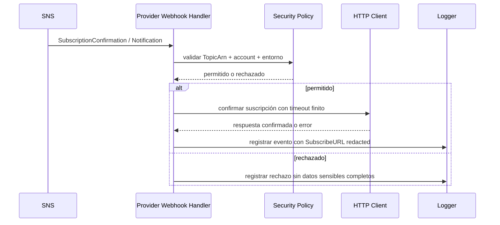
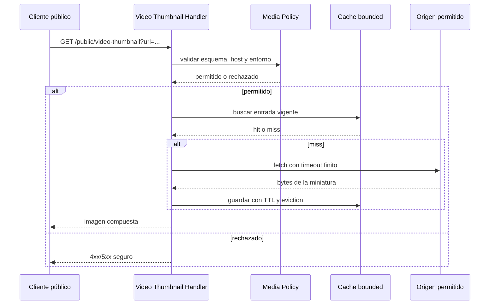

# Design — SNS y perímetro público endurecidos

## Objetivo técnico

Cerrar las superficies públicas y operativas para que ninguna entrada o salida dependa de supuestos implícitos. Todo debe pasar por política explícita, verificable y deny-by-default.

## Modelo de confianza

El sistema debe considerar no confiable todo lo que venga de:

- SNS inbound.
- URLs de descubrimiento OIDC.
- `allowed_origins` de integraciones externas.
- La superficie pública `/public/video-thumbnail`.
- Bypass operativos por variable de entorno.
- Logs operativos que hoy exponen URLs completas.

La corrección correcta es estructural: políticas por entorno, transportes acotados y una frontera de confianza exacta.

## Decisiones de diseño

### 1) SNS inbound: trust binding exacto

El handler de SNS no debe aceptar un `TopicArn` “parecido” ni una cuenta genérica. Debe comparar contra valores esperados explícitos y fallar cerrado si cualquiera de ellos no coincide.

La confirmación de suscripción también debe respetar la misma política:

- Solo confirmar cuando el mensaje y el destino estén alineados con la configuración esperada.
- No seguir redirects de forma implícita.
- No loguear `SubscribeURL` completo.
- Usar un cliente HTTP con timeout finito.

Si `SENDA_SNS_SKIP_SIGNATURE_VERIFICATION` está activo en producción, el sistema debe rechazar la ejecución. En entornos no productivos, el bypass solo puede existir como escape hatch explícito y ruidoso.

### 2) Guard rails de producción para OIDC y orígenes

`oidc.discovery_url` y `allowed_origins` no deben tratar `http://` como normalidad.

Regla propuesta:

- En producción y entornos compartidos, solo HTTPS.
- En desarrollo o test explícito, `http://` solo para casos controlados y con validación adicional.
- El validador debe conocer el entorno; no basta con validar sintaxis de URL.

Esto evita que la configuración válida en local se convierta en una puerta abierta en producción.

### 3) `/public/video-thumbnail`: superficie pública acotada

La superficie de media pública deja de ser un fetcher libre y pasa a ser un proxy de miniaturas con política:

- allowlist de hosts/targets permitidos,
- validación de esquema,
- timeout de transporte,
- cache bounded con TTL y eviction,
- rechazo de destinos inseguros o no canónicos,
- redacción de logs para no exponer URLs completas.

La cache no puede ser un repositorio infinito de bytes en memoria. Debe tener límite y expiración para evitar crecimiento sin control y reutilización indefinida de contenido.

### 4) Higiene operativa del transporte

No se permiten `http.Client{}` sin timeout en estos flujos. Cada cliente debe construirse con una política clara:

- timeout finito,
- redirects controlados o directamente rechazados según el caso,
- logging sanitizado,
- separación entre error técnico y dato sensible.

## Cambios esperados por componente

- `config/config.go`
  - Validación de `oidc.discovery_url` con awareness de entorno.
  - Validación de `allowed_origins` con guard rail para HTTPS en prod.
  - Bloqueo duro de `SENDA_SNS_SKIP_SIGNATURE_VERIFICATION` en producción.

- `internal/http/handler/provider_webhook.go`
  - Binding exacto al `TopicArn`/account esperados.
  - Confirmación de suscripción bajo la misma política.
  - Sanitización de logs y rechazo de contextos inseguros.

- `internal/app/app.go` o fábrica equivalente
  - Construcción de clientes HTTP con timeout explícito.
  - Inyección de la política de seguridad al handler.

- `internal/http/handler/media.go`
  - Sustituir el cache sin TTL por un cache bounded con expiración.
  - Aplicar allowlist, validación de esquema y sanitización de logs.

- `internal/http/middleware/external_integration.go` o validación compartida equivalente
  - Reusar el validador de orígenes para no duplicar reglas de entorno.

## Flujo SNS endurecido

## Flujo de media endurecido

## Tradeoffs

- **HTTPS-only en producción** rompe configuraciones laxas, pero elimina una clase completa de errores de despliegue.
- **Cache bounded con TTL** agrega recomputación ocasional, pero evita crecimiento no controlado y reutilización indefinida.
- **Redacción de logs** reduce detalle operacional, pero protege credenciales y URLs sensibles.
- **Bloquear el bypass en producción** puede incomodar operaciones, pero es el comportamiento correcto.

## Verificación final E2E

La validación final debe ser autónoma y adversarial. Debe demostrar, en un solo flujo reproducible, que:

1. SNS válido entra cuando el `TopicArn` y la cuenta coinciden.
2. SNS inválido o fuera de política falla cerrado.
3. La confirmación de suscripción no filtra `SubscribeURL` completo en logs.
4. `oidc.discovery_url` y `allowed_origins` rechazan HTTP en producción.
5. `/public/video-thumbnail` usa cache bounded y rechaza destinos inseguros.
6. `SENDA_SNS_SKIP_SIGNATURE_VERIFICATION` no permite arrancar en producción.

## Ownership

- El binding SNS pertenece al perímetro de inbound.
- La política de OIDC/orígenes pertenece al validado de configuración.
- La superficie de media pública pertenece al perímetro de fetch.
- La higiene operativa pertenece al bootstrap y al logging común.
