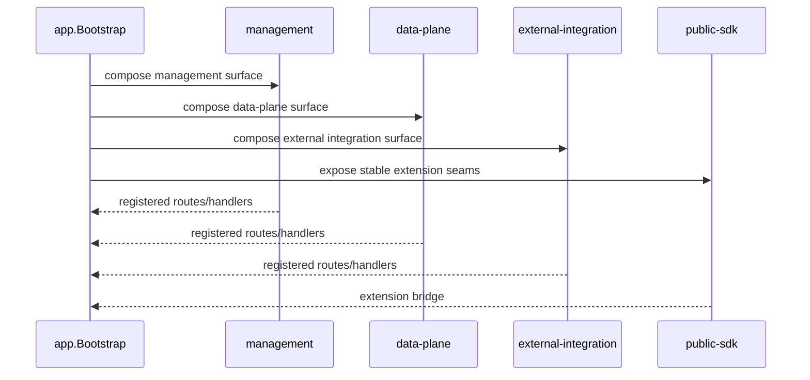

# Design: Modularización de superficies y endurecimiento del SDK

## Technical Approach

La estrategia es convertir la composición actual en un conjunto de ensambladores por superficie. `internal/app/app.go` queda como composition root mínimo; `internal/http/server.go` deja de ser el lugar donde se mezclan todas las responsabilidades; `sdk/` pasa a ser una fachada deliberadamente estrecha.

## Architecture Decisions

### Decision: Separar por superficies reales
**Choice**: Modelar explícitamente `management`, `data-plane`, `external-integration` y `public-sdk`.
**Alternatives considered**: Mantener un servidor monolítico con grupos de rutas internos.
**Rationale**: El monolito de wiring oculta ownership y dificulta endurecer contratos sin romper otras superficies.

### Decision: Bootstrap mínimo
**Choice**: `app.Bootstrap` solo orquesta dependencias compartidas y delega ensambladores por superficie.
**Alternatives considered**: Seguir concentrando toda la composición en `app.go`.
**Rationale**: La composición raíz debe ser legible, testeable y fácil de extender sin inflar el centro de la app.

### Decision: Handlers finos
**Choice**: Los handlers solo adaptan HTTP ↔ servicios/ports.
**Alternatives considered**: Dejar que cada handler resuelva composición, permisos y cross-calls.
**Rationale**: Si el handler conoce demasiado, la superficie HTTP termina siendo un segundo bootstrap disfrazado.

### Decision: SDK explícito y versionable
**Choice**: Exponer seams públicos intencionales y conservar internals detrás de una fachada estable.
**Alternatives considered**: Seguir reexportando tipos internos para conveniencia del consumidor.
**Rationale**: Reexportar internals crea acoplamiento accidental; el SDK debe poder evolucionar sin arrastrar el core.

## Data Flow



## File Changes

| File | Action | Description |
|------|--------|-------------|
| `internal/app/app.go` | Modify | Extraer composición por superficie y reducir el tamaño del bootstrap. |
| `internal/http/server.go` | Modify | Reorganizar registro de rutas para reflejar ownership de superficies. |
| `internal/http/handler/*.go` | Modify | Quitar lógica de composición y dejar handlers más delgados. |
| `sdk/engine.go` | Modify | Enlazar el SDK con seams explícitos y menos conocimiento de internals. |
| `sdk/interfaces.go` / `sdk/types.go` | Modify | Limitar el contrato público a lo que realmente soportamos. |
| `docs/ARCHITECTURE.md` / `docs/extensibility-guide.md` | Modify | Documentar superficies, ownership y API pública estable. |

## Interfaces / Contracts

La forma pública del SDK debe tender a este patrón:

```go
type InjectorRegistration struct {
    Code        string
    Name        string
    Description string
    Static      bool
    TTL         time.Duration
    Fields      []InjectorFieldSpec
    Resolve     ResolveFunc
}
```

Las extensiones externas deben seguir entrando por seams explícitos: injectors, init, auth methods, workspace resolvers y hooks de ciclo de vida.

## Testing Strategy

| Layer | What to Test | Approach |
|-------|-------------|----------|
| Unit | Ensamblaje por superficie y contratos del SDK | Tests de registration, nil-safety y no acoplamiento accidental. |
| Integration | Registro de rutas por superficie | Verificar que cada grupo expone solo lo que le pertenece. |
| E2E | Flujos completos de management, data-plane y external integration | Validar que la modularización no rompe rutas públicas. |

## Migration / Rollout

No migration required. El cambio debe introducirse como refactor estructural compatible con el comportamiento actual, con preservación de rutas y contratos públicos.

## Open Questions

- [ ] ¿Qué tipos del SDK deben permanecer públicos en v1 y cuáles deben quedar ocultos?
- [ ] ¿Conviene introducir un subpaquete versionado para la próxima iteración del SDK o basta con una fachada más estricta?
